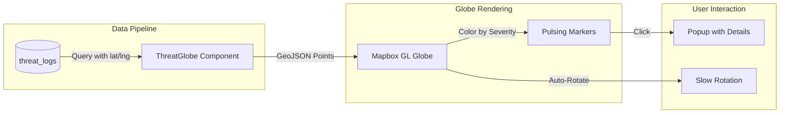
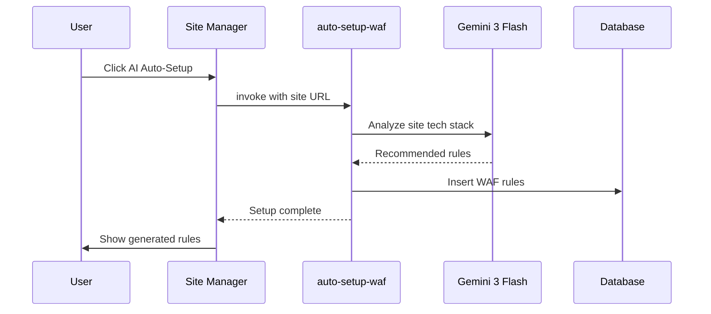
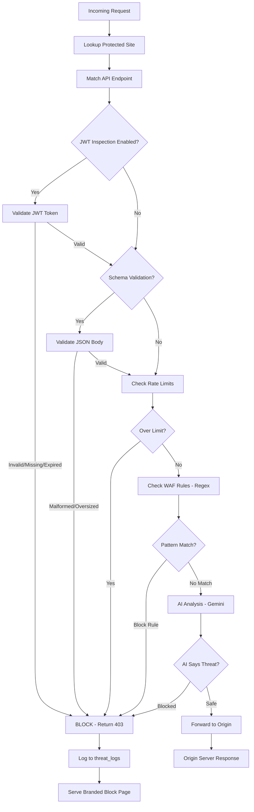
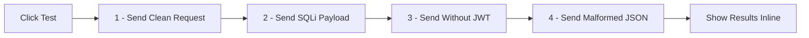
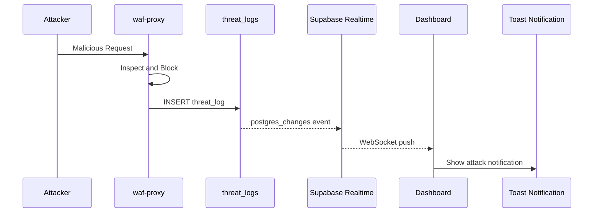
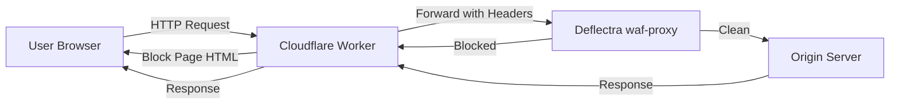
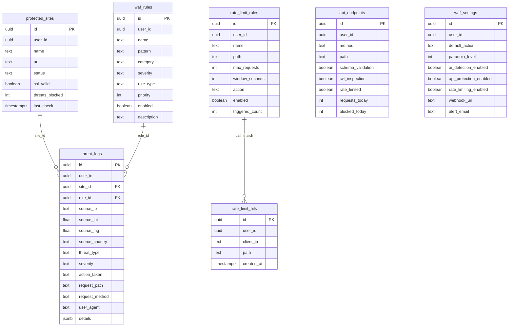

# Deflectra WAF — Technical Documentation

**Application Name:** Deflectra — Adaptive Web Shield  
**Date:** March 8, 2026  
**By:** Ritvik Indupuri

---

## Table of Contents

1. [Executive Summary](#executive-summary)
2. [System Architecture](#system-architecture)
3. [Authentication & Access Control](#authentication--access-control)
4. [Dashboard Overview](#dashboard-overview)
5. [Live Threat Map (Mapbox Globe)](#live-threat-map-mapbox-globe)
6. [Traffic Analytics Chart](#traffic-analytics-chart)
7. [Protected Sites Management](#protected-sites-management)
8. [WAF Proxy — Reverse Proxy Engine](#waf-proxy--reverse-proxy-engine)
9. [Rule Engine](#rule-engine)
10. [AI Threat Detection](#ai-threat-detection)
11. [API Shield](#api-shield)
12. [Rate Limiting](#rate-limiting)
13. [Real-Time Block Notifications](#real-time-block-notifications)
14. [Branded Block Page](#branded-block-page)
15. [Cloudflare Workers Integration](#cloudflare-workers-integration)
16. [Setup Guide](#setup-guide)
17. [Settings & Configuration](#settings--configuration)
18. [Email Notifications](#email-notifications)
19. [Database Architecture](#database-architecture)
20. [Edge Functions Reference](#edge-functions-reference)
21. [Security Controls & RLS Policies](#security-controls--rls-policies)
22. [Production Deployment — Personal Portfolio](#production-deployment--personal-portfolio)
23. [Conclusion](#conclusion)

---

## Executive Summary

Deflectra is a fully functional, AI-powered Web Application Firewall (WAF) built as a modern single-page application. It operates as a **Layer 7 reverse proxy** that inspects, classifies, and either blocks or forwards HTTP requests to protected origin servers.

Unlike traditional WAFs that rely solely on static regex rules, Deflectra combines three layers of defense:

1. **Regex-Based Rule Engine** — Pattern matching against known attack signatures (SQLi, XSS, LFI, RCE) with configurable priority ordering.
2. **AI Threat Classification** — Google Gemini 3 Flash analyzes requests in real-time and classifies them as safe or malicious with confidence scores and geographic origin estimation.
3. **API Shield Enforcement** — JWT token validation, JSON schema validation, and per-IP rate limiting enforced at the proxy layer.

Deflectra was originally built to protect the developer's personal portfolio website ([https://ritvik-website.netlify.app/](https://ritvik-website.netlify.app/)), where it actively inspects all API calls to edge functions (chatbot, contact form, authentication logging, visitor alerts). However, **anyone can create an account** on Deflectra and connect their own web applications for WAF protection.

The application features a full management dashboard with a 3D Mapbox threat globe, real-time WebSocket notifications, traffic analytics, and a branded block page that is served to attackers when requests are rejected.

### Key Metrics

| Metric | Value |
|--------|-------|
| Protected Sites | Unlimited per user |
| Rule Engine | Regex with priority ordering |
| AI Model | Google Gemini 3 Flash |
| Rate Limiting | Per-IP, per-path, configurable windows |
| JWT Validation | Decode + expiry check |
| Schema Validation | JSON structure + size limits |
| Block Page | Branded HTML with severity badges |
| Real-Time Alerts | WebSocket push via Supabase Realtime |
| Threat Visualization | 3D Mapbox GL globe |

---

## System Architecture

```mermaid
flowchart TB
    subgraph Internet["Internet"]
        USER[End User / Attacker]
        CF[Cloudflare Worker]
    end

    subgraph Deflectra["Deflectra WAF"]
        subgraph Frontend["Frontend - React + Vite + TypeScript"]
            AUTH_PAGE[Auth Page]
            DASH[Dashboard]
            GLOBE[Threat Globe - Mapbox]
            SITES[Site Manager]
            RULES[Rule Engine]
            AI_DET[AI Detection]
            API_SH[API Shield]
            RATE[Rate Limiting]
            SETTINGS[Settings]
            SETUP[Setup Guide]
            NOTIFY[Real-Time Toasts]
        end

        subgraph Backend["Supabase Backend"]
            subgraph EdgeFunctions["Edge Functions"]
                WAF_PROXY[waf-proxy]
                ANALYZE[analyze-threat]
                AUTO_SETUP[auto-setup-waf]
                SEND_NOTIF[send-notification]
            end

            subgraph Database["PostgreSQL Database"]
                SITES_T[(protected_sites)]
                RULES_T[(waf_rules)]
                THREATS_T[(threat_logs)]
                RATE_T[(rate_limit_rules)]
                RATE_HITS[(rate_limit_hits)]
                API_EP[(api_endpoints)]
                SETTINGS_T[(waf_settings)]
            end

            REALTIME[Supabase Realtime]
        end
    end

    subgraph External["External Services"]
        GEMINI[Google Gemini 3 Flash]
        MAPBOX[Mapbox GL]
        RESEND[Resend Email API]
        ORIGIN[Origin Server]
    end

    USER -->|HTTP Request| CF
    CF -->|Forward| WAF_PROXY
    WAF_PROXY -->|1 - Check Rules| RULES_T
    WAF_PROXY -->|2 - Check Rate Limits| RATE_HITS
    WAF_PROXY -->|3 - Check API Shield| API_EP
    WAF_PROXY -->|4 - AI Analysis| GEMINI
    WAF_PROXY -->|Log Threat| THREATS_T
    WAF_PROXY -->|Clean Request| ORIGIN
    WAF_PROXY -->|Blocked| USER

    REALTIME -->|Push| NOTIFY
    THREATS_T -->|Insert Event| REALTIME

    DASH --> THREATS_T
    DASH --> SITES_T
    GLOBE --> THREATS_T
    GLOBE --> MAPBOX
    RULES --> RULES_T
    AI_DET --> ANALYZE
    ANALYZE --> GEMINI
    SETTINGS --> SETTINGS_T
    SEND_NOTIF --> RESEND
```



<p align="center"><em>Figure 1: Deflectra WAF System Architecture — Complete technical stack showing the React frontend, Supabase backend with Edge Functions, and external service integrations.</em></p>

### Architecture Breakdown

**Frontend Layer:**
The frontend is built with React 18, Vite, TypeScript, and Tailwind CSS. It uses shadcn/ui components with a custom dark cybersecurity-themed design system. All pages are wrapped in a `DashboardLayout` component that includes the sidebar navigation and the real-time threat notification listener.

**Backend Layer:**
The backend is powered by Supabase (PostgreSQL + Edge Functions + Realtime). The `waf-proxy` edge function is the core of the WAF — it receives all proxied requests and runs them through the inspection pipeline. Four edge functions handle different aspects of the system.

**External Services:**
- **Google Gemini 3 Flash** — AI threat classification via the Lovable AI Gateway
- **Mapbox GL** — 3D globe rendering for geographic threat visualization
- **Resend** — Email delivery for threat alerts and test notifications

---

## Authentication & Access Control

Deflectra uses Supabase Auth for user authentication with email/password credentials. The auth flow works as follows:

1. **Sign Up** — Users create an account with email and password (minimum 6 characters). A verification email is sent.
2. **Sign In** — Authenticated users are redirected to the dashboard. All routes except `/auth` are protected.
3. **Session Management** — Supabase handles JWT session tokens automatically. The `useAuth` hook provides `user`, `loading`, and `signOut` across all components.
4. **Row-Level Security** — Every database table has RLS policies ensuring users can only access their own data. The `user_id` column on every table is matched against `auth.uid()`.

**Anyone can create an account** and start protecting their own websites. The application is not limited to the developer's personal use.

### Auth Page UI

The login page features the Deflectra shield icon, gradient branding, and a toggle between Sign In and Create Account modes. The page uses the same dark design system as the dashboard.

---

## Dashboard Overview

The main dashboard (`/`) provides a real-time overview of the WAF's status with six stat cards:

| Card | Data Source | Description |
|------|------------|-------------|
| Threats Blocked | `protected_sites.threats_blocked` + `threat_logs` count | Total blocked requests across all time |
| Active Threats | `threat_logs` where severity is critical or high | Current high-severity threats |
| Attack Sources | Unique `source_country` values in `threat_logs` | Number of countries attacks originated from |
| Avg Response | — | Placeholder for proxy latency (future feature) |
| Protected Sites | `protected_sites` count | Number of registered origin servers |
| AI Engine | Static | Shows "Gemini v3 Flash" indicator |

Below the stats, the dashboard displays:
- **Live Threat Map** — A 3D Mapbox globe showing threat locations
- **Traffic Chart** — An area chart showing threats over time (24-hour buckets)
- **Threat Table** — Recent threat log entries with severity, type, IP, and action taken

---

## Live Threat Map (Mapbox Globe)

The threat map uses Mapbox GL JS to render an interactive 3D globe visualization of attack sources.



<p align="center"><em>Figure 2: Threat Globe Data Pipeline — How threat log coordinates are rendered as severity-coded markers on the 3D Mapbox globe.</em></p>

**Implementation Details:**
- **Data Source:** Queries `threat_logs` for entries with non-null `source_lat` and `source_lng` values
- **Severity Colors:** Critical (red), High (orange), Medium (yellow), Low (cyan)
- **Marker Sizes:** Critical (12px), High (9px), Medium (7px), Low (5px)
- **Projection:** Globe projection with atmosphere effect enabled
- **Auto-Rotation:** Globe rotates slowly at 0.3°/second when not being interacted with
- **Click Popups:** Clicking a marker shows threat type, severity, country, and source IP

---

## Traffic Analytics Chart

The traffic chart component (`TrafficChart.tsx`) visualizes threat activity over the past 24 hours using Recharts.

**How It Works:**
1. Queries `threat_logs` for the past 24 hours
2. Groups threats into hourly buckets using `created_at` timestamps
3. Renders an area chart with the accent color gradient fill
4. Shows threat count per hour with hover tooltips

---

## Protected Sites Management

The Protected Sites page (`/sites`) allows users to register origin servers that Deflectra will protect.

**Features:**
- **Add Site** — Enter a name and URL for your origin server
- **Proxy URL Generation** — Each site gets a unique proxy URL: `https://<project>.supabase.co/functions/v1/waf-proxy?site_id=<uuid>`
- **Copy to Clipboard** — One-click copy of the proxy URL
- **SSL Status** — Shows SSL validity indicator
- **Threats Blocked Counter** — Displays total blocked requests per site
- **AI Auto-Setup** — One-click button that invokes the `auto-setup-waf` edge function, which uses AI to scan the site and auto-generate WAF rules tailored to its technology stack
- **Delete Site** — Remove a site from protection

### AI Auto-Setup Flow



<p align="center"><em>Figure 1: AI Auto-Setup Flow — How clicking the auto-setup button triggers AI analysis of the target site and generates tailored WAF rules.</em></p>

---

## WAF Proxy — Reverse Proxy Engine

The `waf-proxy` edge function is the core of Deflectra. It acts as a Layer 7 reverse proxy that inspects every incoming HTTP request through a multi-stage pipeline before forwarding clean requests to the origin server.

### Inspection Pipeline



<p align="center"><em>Figure 1: WAF Proxy Inspection Pipeline — The six-stage request inspection flow from incoming request to block/forward decision.</em></p>

### Pipeline Stages in Detail

**Stage 1 — Site Lookup:**
The proxy identifies the target site using the `x-deflectra-site-id` header or `site_id` query parameter. It queries `protected_sites` to retrieve the origin URL and the owning user's ID.

**Stage 2 — API Endpoint Matching:**
The proxy checks if the request path matches any registered API endpoint in `api_endpoints`. If matched, endpoint-specific protections are applied.

**Stage 3 — JWT Inspection:**
If the matched endpoint has `jwt_inspection` enabled:
- Extracts the Bearer token from the `Authorization` header
- Decodes the JWT payload (base64 decode, no signature verification — designed for structure validation)
- Checks for token presence, decodability, and expiration (`exp` claim vs current time)
- Missing, malformed, or expired tokens are blocked with a 403

**Stage 4 — Schema Validation:**
If the matched endpoint has `schema_validation` enabled and the request is POST/PUT/PATCH:
- Attempts to parse the request body as JSON
- Validates that the body is a proper object (not a primitive or null)
- Rejects payloads exceeding 1MB
- Malformed JSON is blocked

**Stage 5 — Rate Limiting:**
Queries `rate_limit_rules` for enabled rules matching the request path:
- Counts recent requests from the same IP in `rate_limit_hits` within the configured window
- If the count exceeds `max_requests`, the request is blocked
- Each request is logged to `rate_limit_hits` for future counting
- The rule's `triggered_count` is incremented on each trigger

**Stage 6 — WAF Rules (Regex):**
Loads all enabled rules from `waf_rules` ordered by priority:
- Constructs a check string from `${targetPath} ${requestBody}`
- Tests each rule's regex pattern against the check string (case-insensitive)
- First matching "block" rule triggers a block
- Rules are processed in priority order (lower number = higher priority)

**Stage 7 — AI Analysis:**
If no rule matched, the request is sent to Google Gemini 3 Flash for classification:
- Sends method, path, body (first 500 chars), user-agent, and IP
- Uses structured tool calling to get a JSON response with: `is_threat`, `threat_type`, `severity`, `confidence`, `reason`, `source_lat`, `source_lng`, `source_country`
- If the AI classifies the request as a threat with action "blocked", it's rejected
- Geographic coordinates are used for threat map visualization

**Stage 8 — Logging & Response:**
- All threats (blocked or logged) are recorded in `threat_logs` with full request metadata
- Blocked requests receive the branded HTML block page (403)
- Clean requests are forwarded to the origin server with `X-Deflectra-Verified: true` header

---

## Rule Engine

The Rule Engine (`/rules`) provides a CRUD interface for managing regex-based WAF rules.

**Rule Properties:**

| Field | Type | Description |
|-------|------|-------------|
| `name` | text | Human-readable rule name |
| `pattern` | text | Regex pattern to match against requests |
| `category` | enum | sqli, xss, rce, lfi, custom, rate_limit, geo_block |
| `severity` | enum | critical, high, medium, low |
| `rule_type` | enum | block, challenge, log, allow |
| `priority` | integer | Execution order (lower = first, default 100) |
| `enabled` | boolean | Toggle rule on/off without deleting |
| `description` | text | Optional notes about the rule |

**Category Color Coding:**
- SQL Injection — Red/destructive
- XSS — Orange/warning  
- RCE — Purple
- LFI — Cyan/primary
- Custom — Blue

**Features:**
- Create rules with name, regex pattern, category, severity, action type, and priority
- Toggle rules enabled/disabled
- Expand rules to see full pattern and description
- Delete rules
- Rules are applied in the waf-proxy in priority order

---

## AI Threat Detection

The AI Detection page (`/ai-detection`) provides a sandbox for testing how Deflectra's AI classifies requests, plus a view of recent AI detections.

### Simulate Incoming Request

Users can craft test requests with:
- **Target Protected Site** — Select from registered sites
- **Request Path** — The URL path to test (e.g., `/api/users?id=1 OR 1=1`)
- **Method** — GET, POST, PUT, DELETE
- **Attacker IP** — Optional, auto-generated if blank
- **User Agent** — Optional
- **Request Body** — Optional JSON payload

The test request is sent to the `analyze-threat` edge function, which calls Gemini 3 Flash to classify it. Results show:
- **Verdict** — BLOCKED or ALLOWED
- **Threat Type** — SQLi, XSS, Path Traversal, etc.
- **Confidence** — 0-100% score
- **Action** — What the WAF would do
- **Explanation** — AI-generated reasoning
- **Indicators** — Specific suspicious patterns found

### Recent AI Detections

Shows the 10 most recent entries from `threat_logs` with:
- Threat type and timestamp
- AI explanation or matched rule description
- Confidence percentage with proper formatting (handles both 0-1 and 0-100 scales)
- Info tooltip explaining the confidence score breakdown:
  - 90-100%: Almost certainly an attack
  - 60-89%: Likely malicious
  - 30-59%: Suspicious, possible false positive
  - 0-29%: Probably safe

### Block Page Preview

An embedded iframe preview showing exactly what attackers see when Deflectra blocks their request. Toggle the preview with a Show/Hide button.

---

## API Shield

The API Shield (`/api-protection`) provides endpoint-level security controls.

### Features

- **Register Endpoints** — Add API paths with method, and toggle protections:
  - Schema Validation (JSON body validation)
  - JWT Inspection (Bearer token validation)
  - Rate Limiting (per-endpoint rate control)
- **Request/Block Counters** — Track `requests_today` and `blocked_today` per endpoint
- **Test Button** — Per-endpoint test that runs 4 checks:

### Test Button Pipeline



<p align="center"><em>Figure 1: API Shield Test Pipeline — The four automated tests run for each endpoint when the test button is clicked.</em></p>

Each test sends a real request through the `waf-proxy` edge function and checks if it passes or gets blocked:
1. **Clean Request** — Should pass (validates WAF doesn't false-positive)
2. **SQLi Attack** — Should be blocked (validates rule engine works)
3. **No-JWT Request** — Should be blocked if JWT inspection is enabled
4. **Malformed JSON** — Should be blocked if schema validation is enabled

### Pre-Populated Portfolio Endpoints

The following endpoints are pre-configured for the developer's portfolio:

| Method | Path | Schema | JWT | Rate Limited |
|--------|------|--------|-----|-------------|
| POST | /functions/v1/send-contact-email | ✓ | ✗ | ✓ |
| POST | /functions/v1/portfolio-chatbot | ✓ | ✗ | ✓ |
| POST | /functions/v1/log-auth-attempt | ✓ | ✓ | ✓ |
| POST | /functions/v1/send-visitor-alert | ✓ | ✓ | ✗ |
| POST | /functions/v1/send-recruiter-alert | ✓ | ✓ | ✗ |

---

## Rate Limiting

The Rate Limiting page (`/rate-limiting`) allows users to create per-IP, per-path rate limit rules.

**Rule Configuration:**

| Field | Description | Default |
|-------|-------------|---------|
| Name | Human-readable rule name | — |
| Path | URL path pattern to match | — |
| Max Requests | Maximum requests allowed in the window | 100 |
| Window (seconds) | Time window for counting requests | 60 |
| Action | What to do when limit is exceeded (block/challenge/throttle) | block |
| Enabled | Toggle on/off | true |

**How Rate Limiting Works in the Proxy:**

1. When a request arrives at `waf-proxy`, it loads all enabled rate limit rules for the site's owner
2. For each matching rule (path match), it counts entries in `rate_limit_hits` from the same IP within the window
3. If the count exceeds `max_requests`, the request is blocked and `triggered_count` is incremented
4. Each request is logged to `rate_limit_hits` for future counting

**Stats Displayed:**
- Total Rules configured
- Active Rules (enabled)
- Total Triggers (times limits were hit)

---

## Real-Time Block Notifications

Deflectra uses Supabase Realtime to push instant notifications when attacks are blocked.



<p align="center"><em>Figure 1: Real-Time Notification Flow — How blocked attacks trigger instant toast notifications in the dashboard via WebSocket.</em></p>

**Implementation:**
- The `useRealtimeThreats` hook subscribes to `INSERT` events on `threat_logs` filtered by `user_id`
- When a blocked threat is inserted, a Sonner toast appears with the attacker's IP and threat type
- The hook is activated in `DashboardLayout`, so notifications work on every page
- Blocked attacks show error-style toasts; logged threats show warning-style toasts

---

## Branded Block Page

When the WAF blocks a request, instead of returning raw JSON, it serves a fully branded HTML page.

**Block Page Features:**
- Dark background (#0a0e1a) with subtle grid overlay
- Animated Deflectra shield logo (SVG with cyan/blue gradient and pulsing checkmark)
- Color-coded severity badge (critical=red, high=orange, medium=yellow, low=green)
- Gradient "Request Blocked" heading
- Details panel showing: Reason, Rule, Attacker IP, Path, Method
- "Protected by Deflectra WAF" footer with mini shield icon
- Fully self-contained HTML (no external dependencies)

The block page is generated server-side in the `waf-proxy` edge function and served with `Content-Type: text/html; charset=utf-8`.

---

## Cloudflare Workers Integration

For production deployment, a Cloudflare Worker acts as the entry point, forwarding all traffic through Deflectra's WAF proxy before it reaches the origin server.

### How It Works



<p align="center"><em>Figure 1: Cloudflare Worker Traffic Flow — How the worker routes requests through Deflectra's WAF proxy and forwards responses back to the user.</em></p>

### Cloudflare Worker Code

The following worker is deployed on Cloudflare Workers to route traffic through Deflectra:

```javascript
export default {
  async fetch(request, env) {
    const url = new URL(request.url);
    const path = url.pathname + url.search;

    const wafProxyUrl = `https://mgveeoqkhthibpmmljxz.supabase.co/functions/v1/waf-proxy?site_id=052a39c2-c570-41f1-a340-50ca2f38ebef&path=${encodeURIComponent(path)}`;

    const body = ['GET', 'HEAD'].includes(request.method)
      ? undefined
      : await request.text();

    const wafResponse = await fetch(wafProxyUrl, {
      method: request.method,
      headers: {
        'Content-Type': request.headers.get('Content-Type') || 'application/json',
        'User-Agent': request.headers.get('User-Agent') || 'unknown',
        'X-Forwarded-For': request.headers.get('CF-Connecting-IP') || 'unknown',
        'Authorization': 'Bearer <SUPABASE_ANON_KEY>',
        'apikey': '<SUPABASE_ANON_KEY>',
      },
      body,
    });

    const responseBody = await wafResponse.arrayBuffer();

    return new Response(responseBody, {
      status: wafResponse.status,
      headers: {
        'Content-Type': wafResponse.headers.get('Content-Type') || 'text/html',
        'X-Deflectra-Action': wafResponse.headers.get('X-Deflectra-Action') || 'unknown',
        'X-Deflectra-Protected': 'true',
        'Access-Control-Allow-Origin': '*',
      },
    });
  },
};
```

**Key Details:**
- The worker passes the `Authorization` and `apikey` headers required by Supabase Edge Functions
- `Content-Type` is forwarded from the WAF response so block pages render as HTML in the browser
- `X-Forwarded-For` is set to the real client IP using `CF-Connecting-IP`
- `arrayBuffer()` is used instead of `text()` to preserve binary data integrity

---

## Setup Guide

The Setup Guide page (`/setup-guide`) provides step-by-step instructions for connecting any web application to Deflectra:

1. **Add Your Site** — Register the origin URL in Protected Sites
2. **Copy the Proxy URL** — Get the generated WAF proxy endpoint
3. **Configure Your App** — Point your application's API calls through the proxy URL
4. **Optional: Cloudflare Worker** — Deploy a worker for full traffic interception
5. **Verify** — Run the AI auto-setup to generate recommended rules

The setup guide includes copyable code blocks for each step.

---

## Settings & Configuration

The Settings page (`/settings`) provides global WAF configuration:

### Security Settings

| Setting | Options | Default |
|---------|---------|---------|
| Paranoia Level | Level 1 (Low) through Level 4 (Maximum) | Level 1 |
| Default Action | Block, Challenge, Log Only | Block |

### Notification Settings

| Setting | Description |
|---------|-------------|
| Webhook URL | Slack/Discord webhook for alerts |
| Alert Email | Email address for threat notifications |
| Resend API Key | API key for email delivery via Resend |

### Email Test

Users can send a test notification email to verify their Resend API key and alert email are configured correctly.

---

## Email Notifications

Deflectra supports email notifications via the Resend API through the `send-notification` edge function.

**Features:**
- Test email sending from Settings page
- Configurable alert email address
- Resend API key stored client-side (localStorage) for user privacy
- HTML-formatted emails with Deflectra branding

---

## Database Architecture



<p align="center"><em>Figure 1: Database Entity-Relationship Diagram — All seven tables and their relationships in the Deflectra WAF database.</em></p>

### Table Details

| Table | Purpose | RLS Policy |
|-------|---------|------------|
| `protected_sites` | Origin servers under WAF protection | Users can CRUD their own sites |
| `waf_rules` | Regex patterns for threat detection | Users can CRUD their own rules |
| `threat_logs` | All detected threats with full metadata | Users can INSERT and SELECT their own logs |
| `rate_limit_rules` | Per-IP rate limiting configuration | Users can CRUD their own rules |
| `rate_limit_hits` | Per-IP request counting for rate limits | Service role only (used by waf-proxy) |
| `api_endpoints` | Registered API endpoints with protections | Users can CRUD their own endpoints |
| `waf_settings` | Global WAF configuration per user | Users can INSERT, UPDATE, SELECT their own settings |

---

## Edge Functions Reference

| Function | Purpose | Trigger |
|----------|---------|---------|
| `waf-proxy` | Core reverse proxy — inspects and forwards/blocks requests | HTTP requests via Cloudflare Worker or direct call |
| `analyze-threat` | AI threat analysis sandbox — classifies test requests | Manual invocation from AI Detection page |
| `auto-setup-waf` | AI-powered rule generation — scans a site and creates rules | One-click from Protected Sites page |
| `send-notification` | Email delivery — sends alerts via Resend API | Settings page test button |

---

## Security Controls & RLS Policies

Every table in Deflectra has Row-Level Security (RLS) enabled with policies ensuring strict data isolation:

- **SELECT** — `auth.uid() = user_id` — Users can only read their own data
- **INSERT** — `auth.uid() = user_id` — Users can only create records with their own user_id
- **UPDATE** — `auth.uid() = user_id` — Users can only modify their own records
- **DELETE** — `auth.uid() = user_id` — Users can only delete their own records

The `rate_limit_hits` table uses a `false` policy (service role only) since it's only accessed by the `waf-proxy` edge function using the service role key.

The `waf-proxy` edge function uses the `SUPABASE_SERVICE_ROLE_KEY` to bypass RLS when logging threats and counting rate limit hits, since these operations occur on behalf of the site owner (not the attacking user).

---

## Production Deployment — Personal Portfolio

Deflectra was originally built to protect the developer's personal portfolio website:

- **Portfolio URL:** [https://ritvik-website.netlify.app/](https://ritvik-website.netlify.app/)
- **Hosting:** Lovable (published at ritvik-indupuri-portfolio.lovable.app)

### Protected Edge Functions

The following portfolio edge functions are routed through Deflectra via `smartInvoke()`:

| Function | Purpose |
|----------|---------|
| `send-contact-email` | Contact form email delivery |
| `portfolio-chatbot` | RAG-powered AI chatbot |
| `log-auth-attempt` | Authentication attempt logging |
| `send-visitor-alert` | Visitor engagement alerts |
| `send-recruiter-alert` | Recruiter-specific alerts |

### Traffic Flow

```
Visitor → Portfolio Frontend → smartInvoke() → Deflectra WAF Proxy → Inspect Payload → Forward Clean Request → Portfolio Edge Function → Response Back
```

Static assets (HTML, CSS, JS) are served directly by Lovable and do not pass through the WAF, as they are not dynamic and don't require inspection.

---

## Conclusion

Deflectra is a production-grade, AI-powered Web Application Firewall that combines traditional regex-based pattern matching with modern LLM-powered threat classification. Its six-stage inspection pipeline (API Shield → Rate Limiting → WAF Rules → AI Analysis → Logging → Block/Forward) provides comprehensive protection against common web attacks including SQL injection, cross-site scripting, path traversal, and brute force attempts.

The application demonstrates full-stack development capabilities across:
- **Frontend:** React, TypeScript, Tailwind CSS, shadcn/ui, Mapbox GL, Recharts, Framer Motion
- **Backend:** Supabase (PostgreSQL, Edge Functions, Realtime, Auth, RLS)
- **AI:** Google Gemini 3 Flash via structured tool calling
- **Infrastructure:** Cloudflare Workers for edge routing

While originally built to protect the developer's personal portfolio, Deflectra is designed as a multi-tenant application where **anyone can create an account and connect their own web applications** for WAF protection.
