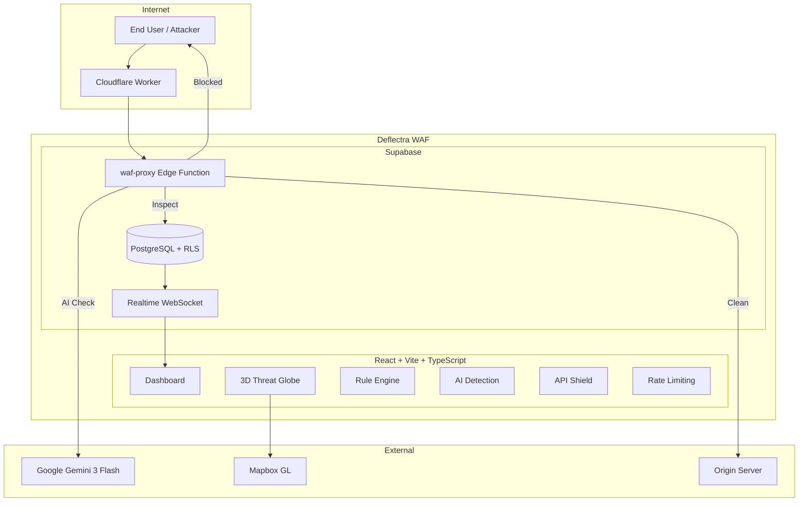

# Deflectra — Adaptive Web Shield

An AI-powered Web Application Firewall (WAF) that operates as a Layer 7 reverse proxy, combining regex-based pattern matching, Google Gemini AI threat classification, JWT validation, schema enforcement, and per-IP rate limiting to protect web applications from common attacks.

> 🌐 **[Live Demo → https://aiwaf.netlify.app](https://aiwaf.netlify.app/)**

> 📖 **[Full Technical Documentation →](DOCUMENTATION.md)**

**Anyone can create an account** and connect their own web applications for AI-powered WAF protection.

---

## 🔑 Key Features

- **AI-Powered Threat Detection** — Google Gemini analyzes suspicious requests in real-time, classifying attack intent with adjustable paranoia levels (1–4)
- **Regex Rule Engine** — Pre-built and custom regex patterns for SQLi, XSS, RCE, LFI, and path traversal with priority-based execution ordering
- **Per-IP Rate Limiting** — Configurable request thresholds per endpoint with block, throttle, or challenge actions
- **API Protection** — JWT token inspection, JSON schema validation, and per-endpoint rate limiting for REST APIs
- **3D Threat Globe** — Real-time Mapbox GL visualization showing attack origins with animated arcs and country-level attribution
- **Auto-Configuration** — AI analyzes your application's tech stack and auto-generates tailored WAF rules, rate limits, and API endpoint protections
- **Real-Time Dashboard** — Live threat logs, traffic analytics, block rate metrics, and top attack type breakdowns via Supabase Realtime
- **Branded Block Pages** — Custom-styled block pages served to attackers with threat details and incident IDs
- **Email & Webhook Alerts** — Configurable notifications via Resend API and webhook integrations for Slack, Discord, or custom endpoints
- **Multi-Site Management** — Protect multiple web applications from a single dashboard with per-site analytics

---

## 📐 System Architecture

<p align="center"><strong>Figure 1 — Deflectra System Architecture</strong></p>



---

## 🔄 Architectural Flow Breakdown

Every inbound request passes through a **6-stage inspection pipeline** inside the `waf-proxy` Edge Function before reaching the origin server:

1. **JWT Inspection** — If the target endpoint has JWT inspection enabled, the proxy validates the `Authorization` header. Invalid or expired tokens are rejected immediately with a `401` response.

2. **Schema Validation** — For `POST` and `PUT` requests on endpoints with schema validation enabled, the JSON body is checked against expected field types and required properties. Malformed payloads are blocked before they reach the origin.

3. **Rate Limiting** — The proxy tracks per-IP request counts against configurable thresholds (e.g., 5 requests per 60 seconds for login endpoints). When a client exceeds the limit, the configured action fires — block, throttle, or challenge.

4. **Regex Rule Matching** — The request URL, query parameters, headers, and body are matched against all enabled WAF rules sorted by priority. Rules cover SQLi (`UNION SELECT`, `OR 1=1`), XSS (`<script>`, `onerror=`), RCE (`; ls`, `| cat`), LFI (`../../etc/passwd`), and custom patterns.

5. **AI Analysis** — Requests that pass regex matching but appear suspicious are forwarded to Google Gemini for deep analysis. The AI evaluates the full request context — method, path, headers, body — and returns a threat classification with confidence score. The paranoia level controls the sensitivity threshold.

6. **Decision** — Clean requests are forwarded to the origin server with all original headers. Blocked requests receive a branded HTML block page containing the threat type, matched rule, incident ID, and timestamp.

All inspection results — whether blocked or allowed — are logged to the `threat_logs` table with source IP, geolocation (latitude/longitude), matched rule, severity, and action taken. These logs power the real-time dashboard, threat globe, and notification system via Supabase Realtime subscriptions.

---

## 🔧 Tech Stack

### Frontend
| Technology | Purpose |
|-----------|---------|
| **React 18** | Component-based UI framework |
| **Vite** | Build tooling and dev server |
| **TypeScript** | Type-safe development |
| **Tailwind CSS** | Utility-first styling |
| **shadcn/ui** | Accessible component library |
| **Recharts** | Traffic and analytics charts |
| **Mapbox GL JS** | 3D threat globe visualization |
| **Framer Motion** | Page transitions and animations |

### Backend & Infrastructure
| Technology | Purpose |
|-----------|---------|
| **Supabase PostgreSQL** | Database with Row-Level Security |
| **Supabase Edge Functions** | Serverless WAF proxy and AI analysis |
| **Supabase Auth** | User authentication and session management |
| **Supabase Realtime** | Live threat log streaming via WebSocket |
| **Google Gemini 3 Flash** | AI-powered threat classification |
| **Cloudflare Workers** | Optional edge-level traffic interception |
| **Resend API** | Email alert delivery |

---

## 🚀 Setup Guide

### Step 1: Access the Application

1. Open the live deployment at **[https://aiwaf.netlify.app](https://aiwaf.netlify.app/)**
2. You will land on the **Auth** page

### Step 2: Create Your Account

1. Click the **Sign Up** tab
2. Enter your email address and choose a password
3. Click **Sign Up**
4. Check your email inbox for a verification link
5. Click the verification link to confirm your account
6. Return to the app and **Sign In** with your credentials

### Step 3: Explore the Dashboard

Once logged in, you will see the main dashboard with:
- **Requests blocked** — total threats stopped
- **Block rate** — percentage of malicious traffic
- **Traffic over time** — request volume charts
- **Recent threats** — latest blocked attacks

The sidebar on the left provides access to every feature. There is also a **Setup Guide** tab in the sidebar that walks you through the entire configuration process step by step within the application itself.

### Step 4: Add Your First Protected Site

1. Navigate to **Sites** in the sidebar
2. Click **Add Site**
3. Enter your application's URL (e.g., `https://myapp.com`)
4. Give it a name (optional — defaults to the hostname)
5. Click **Protect Site**

Once added, AI automatically analyzes your application — detecting your tech stack, discovering API endpoints, and generating tailored WAF rules. You will see a **WAF Proxy Endpoint** URL that you will use to route traffic through the firewall.

### Step 5: Configure WAF Rules

1. Navigate to **Rules** in the sidebar
2. Click **Generate with AI** to auto-create rules based on your site's tech stack
3. AI generates rules for SQLi, XSS, RCE, LFI, and path traversal specific to your stack
4. Each rule shows its name, regex pattern, category, severity, and priority
5. Toggle individual rules on or off as needed
6. To add a custom rule, click **Add Rule** and fill in the pattern, category, severity, priority (1–1000, lower runs first), and action (block, log, or challenge)

### Step 6: Configure Rate Limiting

1. Navigate to **Rate Limiting** in the sidebar
2. Click **Generate with AI** to auto-create rate limits based on detected endpoints
3. AI sets sensible defaults — for example, 5 requests/minute for login, 100 for general API endpoints
4. To add a custom rule, click **Add Rule** and specify the path, max requests, window (seconds), and action
5. Recommended starting points:
   - `/login` → 5 requests / 60 seconds
   - `/register` → 3 requests / 60 seconds
   - `/api/*` → 100 requests / 60 seconds
   - Contact forms → 10 requests / 60 seconds

### Step 7: Configure API Protection

1. Navigate to **API Protection** in the sidebar
2. Click **Generate with AI** to auto-discover and protect your API endpoints
3. For each endpoint, configure:
   - **JWT Inspection** — toggle on for any authenticated route
   - **Schema Validation** — toggle on for POST/PUT endpoints to validate request bodies
   - **Rate Limited** — toggle on to apply rate limiting to the endpoint
4. To manually add an endpoint, click **Add Endpoint** and specify the path and HTTP method

### Step 8: Configure AI Detection

1. Navigate to **AI Detection** in the sidebar
2. Toggle **AI Detection Enabled** to ON
3. Set the **Paranoia Level** (1–4):
   - Level 1 — low sensitivity, fewer false positives
   - Level 2 — balanced (recommended for most applications)
   - Level 3 — high sensitivity, may flag legitimate requests
   - Level 4 — maximum paranoia, aggressive blocking
4. Set the **Default Action** for detected threats (block, log, or challenge)
5. Optionally enter an **Alert Email** to receive notifications when threats are blocked
6. Optionally enter a **Webhook URL** to send alerts to Slack, Discord, or a custom endpoint

### Step 9: Route Traffic Through the WAF

After configuration, integrate the WAF proxy into your application. The proxy endpoint follows this format:

```
https://<project-url>/functions/v1/waf-proxy?site_id=YOUR_SITE_ID&path=/your-endpoint
```

**Option A — Direct API Calls (recommended for specific endpoints):**

```typescript
// Before: Direct call
const response = await fetch('https://your-backend.com/api/contact', {
  method: 'POST',
  body: JSON.stringify(data)
});

// After: Through Deflectra WAF
const WAF_PROXY = 'https://<project-url>/functions/v1/waf-proxy';
const SITE_ID = 'your-site-id-from-deflectra';

const response = await fetch(`${WAF_PROXY}?site_id=${SITE_ID}&path=/api/contact`, {
  method: 'POST',
  body: JSON.stringify(data)
});
```

**Option B — Cloudflare Worker (full traffic interception):**

```javascript
const WAF_PROXY = 'https://<project-url>/functions/v1/waf-proxy';
const SITE_ID = 'your-site-id';

export default {
  async fetch(request) {
    const url = new URL(request.url);
    const wafUrl = `${WAF_PROXY}?site_id=${SITE_ID}&path=${url.pathname}`;
    return fetch(wafUrl, {
      method: request.method,
      headers: request.headers,
      body: request.body
    });
  }
};
```

### Step 10: Monitor and Tune

1. **Threat Globe** (`/globe`) — watch real-time attack origins on a 3D map with animated arcs
2. **Threats** (`/threats`) — review detailed logs with IP, country, attack type, matched rule, severity, and action taken
3. **Notifications** — check the notification center for alerts on critical and high-severity threats
4. **Settings** — verify all protection layers are enabled (AI Detection, Rate Limiting, API Protection)

Review the threats page weekly to identify false positives. If legitimate requests are being blocked, lower the paranoia level or disable specific rules that are too aggressive.

> 💡 **Tip:** Deflectra includes a built-in **Setup Guide** tab in the sidebar that walks you through every configuration step directly within the application.

---

## 📄 License

MIT
