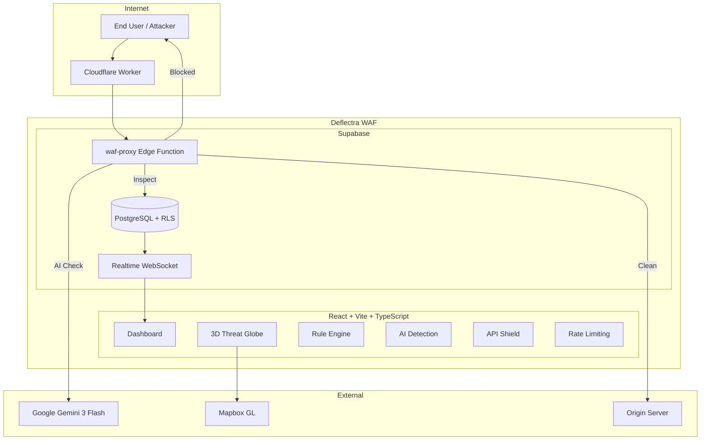

# Deflectra — Adaptive Web Shield

An AI-powered Web Application Firewall (WAF) that operates as a Layer 7 reverse proxy, combining regex-based pattern matching, Google Gemini AI threat classification, JWT validation, schema enforcement, and per-IP rate limiting to protect web applications from common attacks.

Originally built to protect [https://ritvik-website.netlify.app/](https://ritvik-website.netlify.app/), but **anyone can create an account** and connect their own applications for WAF protection.

## System Architecture

<em>Figure 1: Deflectra System Architecture</em>

### How It Works

1. **Traffic Interception** — All incoming requests hit the Cloudflare Worker at the edge, which forwards them to the WAF proxy for inspection before they ever reach your origin server.

2. **6-Stage Inspection Pipeline** — Each request passes through a layered security check:
   - *API Shield* checks JWT tokens and validates request bodies against schemas
   - *Rate Limiter* tracks per-IP request counts and blocks abusers
   - *Regex Engine* matches against SQLi, XSS, LFI, and RCE attack patterns
   - *AI Analysis* sends suspicious requests to Gemini for classification with confidence scoring
   - *Logger* records all threats with IP geolocation for the dashboard
   - *Decision* either forwards clean traffic to origin or serves a branded block page

3. **Real-Time Dashboard Updates** — When an attack is blocked, the database triggers a WebSocket event that instantly pushes the threat data to all connected dashboard sessions.

4. **Geographic Visualization** — Blocked attacks are plotted on a 3D globe with animated arcs showing attack origin → target, helping you visualize threat patterns at a glance.

### Architecture Breakdown

| Layer | Component | What It Does |
|-------|-----------|--------------|
| Edge | Cloudflare Worker | Sits in front of your app, intercepts all traffic, and routes it through the WAF before forwarding to origin |
| WAF Engine | waf-proxy Function | Runs the 6-stage inspection pipeline, makes block/allow decisions, logs threats |
| AI Layer | Gemini 3 Flash | Analyzes ambiguous requests that pass regex checks, returns threat classification + confidence score + estimated country of origin |
| Database | PostgreSQL + RLS | Stores rules, threats, sites, and settings with row-level security isolating each user's data |
| Real-Time | Supabase Realtime | Pushes blocked threat events to the dashboard via WebSocket subscriptions |
| Visualization | Mapbox GL JS | Renders a 3D globe with attack arcs, rotating view, and threat markers |

## Tech Stack

### Frontend
React 18, Vite, TypeScript, Tailwind CSS, shadcn/ui, Recharts, Mapbox GL JS, Framer Motion

### Backend
Supabase (PostgreSQL, Edge Functions, Auth, Realtime), Google Gemini 3 Flash, Cloudflare Workers, Resend API

## Features

### Security Engine
- **Reverse Proxy WAF** — All traffic routes through the WAF before reaching your origin, giving you full request inspection without changing your backend code
- **Regex Rule Engine** — Pre-built patterns for SQLi, XSS, LFI, RCE, and path traversal attacks. Rules have priority ordering so critical checks run first, and you can add custom patterns
- **AI Threat Classification** — Requests that look suspicious but don't match known patterns get sent to Gemini 3 Flash, which returns a threat type, confidence score (0-100), and estimated geographic origin
- **Branded Block Page** — Attackers see a professional "Access Denied" page with your branding instead of raw error codes

### API Protection
- **API Shield** — Define protected endpoints with per-route controls for JWT inspection and JSON schema validation
- **Rate Limiting** — Configurable per-IP limits with sliding windows (e.g., 100 requests per 60 seconds), with automatic blocking when thresholds are exceeded

### Dashboard & Monitoring
- **3D Threat Globe** — Live visualization of blocked attacks on a rotating Mapbox globe, with animated arcs showing attack source to your server
- **Real-Time Threat Feed** — WebSocket-powered table that updates instantly when new threats are blocked
- **Traffic Analytics** — Charts showing request volume, block rates, and threat type distribution over time

### AI-Powered Auto-Configuration
- **AI Auto-Setup** — Paste your site URL and the AI analyzes your application, then generates recommended WAF rules tailored to your tech stack and exposed endpoints
- **AI Auto-Fill** — One-click "Generate with AI" button across all configuration forms (Rule Engine, Rate Limiting, API Shield, AI Detection). The AI deep-crawls your protected site, discovers endpoints, identifies your tech stack, and auto-generates security configurations — no manual input required
- **Multi-Site Support** — Protect multiple applications from a single dashboard, each with its own rules and analytics
- **Email Notifications** — Get alerts via Resend when high-severity attacks are blocked

## Setup Instructions

1. Clone and install: `git clone <repo> && npm install`
2. Set `.env`: `VITE_SUPABASE_URL`, `VITE_SUPABASE_PUBLISHABLE_KEY`, `VITE_SUPABASE_PROJECT_ID`
3. Push DB migrations: `npx supabase db push`
4. Deploy edge functions: `npx supabase functions deploy waf-proxy analyze-threat auto-setup-waf auto-generate-fields send-notification`
5. Set secrets: `npx supabase secrets set LOVABLE_API_KEY=<key>`
6. Run: `npm run dev`
7. Create account at `/auth`, add a site in Protected Sites, copy proxy URL
8. Route your app's API calls through the proxy URL
9. Optional: Deploy Cloudflare Worker for full traffic interception

## Production Use

Protecting [https://ritvik-website.netlify.app/](https://ritvik-website.netlify.app/) with 5 edge functions routed through the WAF: `send-contact-email`, `portfolio-chatbot`, `log-auth-attempt`, `send-visitor-alert`, `send-recruiter-alert`.

## License

MIT
