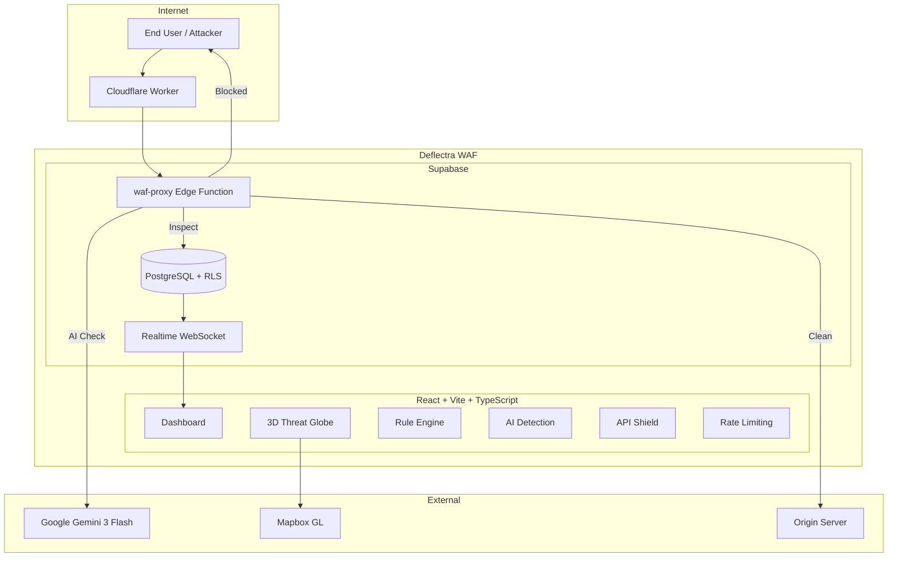

# Deflectra — Adaptive Web Shield

An AI-powered Web Application Firewall (WAF) that operates as a Layer 7 reverse proxy, combining regex-based pattern matching, Google Gemini AI threat classification, JWT validation, schema enforcement, and per-IP rate limiting to protect web applications from common attacks.

Originally built to protect [https://ritvik-website.netlify.app/](https://ritvik-website.netlify.app/), but **anyone can create an account** and connect their own applications for WAF protection.

## System Architecture

*Figure 1: Deflectra System Architecture*

### Architecture Breakdown

| Layer | Technology | Purpose |
|-------|-----------|---------|
| Entry Point | Cloudflare Workers | Routes traffic through WAF proxy |
| WAF Engine | Supabase Edge Function | 6-stage inspection: API Shield, Rate Limiting, Regex Rules, AI Analysis, Logging, Block/Forward |
| AI Model | Google Gemini 3 Flash | Classifies requests with confidence scores and geo-estimation |
| Frontend | React 18 + Vite + TypeScript + Tailwind CSS | Dashboard with real-time monitoring |
| Database | PostgreSQL with Row-Level Security | Multi-tenant data isolation |
| Real-Time | Supabase Realtime (WebSocket) | Instant block notifications |
| Visualization | Mapbox GL JS | 3D globe showing attack sources |

## Tech Stack

React 18, Vite, TypeScript, Tailwind CSS, shadcn/ui, Recharts, Mapbox GL JS, Framer Motion, Supabase (PostgreSQL, Edge Functions, Auth, Realtime), Google Gemini 3 Flash, Cloudflare Workers, Resend API

## Features

- **Reverse Proxy WAF** — Layer 7 inspection pipeline
- **Regex Rule Engine** — SQLi, XSS, LFI, RCE patterns with priority ordering
- **AI Threat Classification** — Gemini 3 Flash with confidence scores
- **API Shield** — JWT inspection, schema validation, per-endpoint controls
- **Rate Limiting** — Per-IP counting with configurable windows
- **3D Threat Globe** — Mapbox GL geographic visualization
- **Real-Time Notifications** — WebSocket push on blocked attacks
- **Branded Block Page** — Professional HTML served to attackers
- **AI Auto-Setup** — One-click rule generation from site analysis
- **Cloudflare Worker Integration** — Edge routing for full traffic interception

## Setup Instructions

1. Clone and install: `git clone <repo> && npm install`
2. Set `.env`: `VITE_SUPABASE_URL`, `VITE_SUPABASE_PUBLISHABLE_KEY`, `VITE_SUPABASE_PROJECT_ID`
3. Push DB migrations: `npx supabase db push`
4. Deploy edge functions: `npx supabase functions deploy waf-proxy analyze-threat auto-setup-waf send-notification`
5. Set secrets: `npx supabase secrets set LOVABLE_API_KEY=<key>`
6. Run: `npm run dev`
7. Create account at `/auth`, add a site in Protected Sites, copy proxy URL
8. Route your app's API calls through the proxy URL
9. Optional: Deploy Cloudflare Worker for full traffic interception

## Production Use

Protecting [https://ritvik-website.netlify.app/](https://ritvik-website.netlify.app/) with 5 edge functions routed through the WAF: `send-contact-email`, `portfolio-chatbot`, `log-auth-attempt`, `send-visitor-alert`, `send-recruiter-alert`.

## License

MIT
