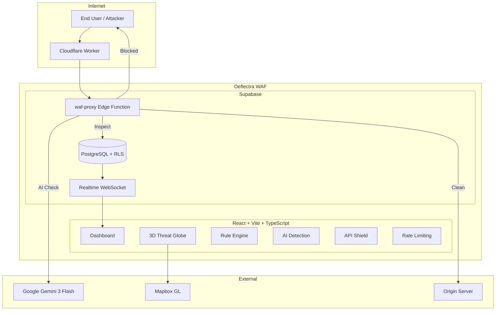

# Deflectra — Adaptive Web Shield

An AI-powered Web Application Firewall (WAF) that operates as a Layer 7 reverse proxy, combining regex-based pattern matching, Google Gemini AI threat classification, JWT validation, schema enforcement, and per-IP rate limiting to protect web applications from common attacks.

> 📖 **[Full Technical Documentation →](DOCUMENTATION.md)**

Originally built to protect [https://ritvik-website.netlify.app/](https://ritvik-website.netlify.app/), but **anyone can create an account** and connect their own applications for WAF protection.

---

## 🚀 Quick Start Guide

### Step 1: Create Your Account

1. Navigate to the **Auth** page (`/auth`)
2. Sign up with your email and password
3. Verify your email address
4. Log in to access the dashboard

### Step 2: Add Your First Protected Site

1. Go to **Sites** in the sidebar
2. Click **Add Site**
3. Enter your application's URL (e.g., `https://myapp.com`)
4. Give it a name (optional — defaults to hostname)
5. Click **Protect Site**

**What happens next:**
- AI automatically analyzes your application
- Detects your tech stack (React, Node, PHP, etc.)
- Generates tailored WAF rules for common attacks
- Sets up rate limiting for sensitive endpoints
- Configures API monitoring for detected endpoints

### Step 3: Route Traffic Through the WAF

After adding your site, you'll see a **WAF Proxy Endpoint** like:

```
https://mgveeoqkhthibpmmljxz.supabase.co/functions/v1/waf-proxy?site_id=YOUR_SITE_ID&path=/your-endpoint
```

**Integration Options:**

#### Option A: Direct API Calls (Recommended for Edge Functions)

Replace your direct API calls with the WAF proxy:

```typescript
// Before: Direct call
const response = await fetch('https://your-backend.com/api/contact', {
  method: 'POST',
  body: JSON.stringify(data)
});

// After: Through Deflectra WAF
const WAF_PROXY = 'https://mgveeoqkhthibpmmljxz.supabase.co/functions/v1/waf-proxy';
const SITE_ID = 'your-site-id-from-deflectra';

const response = await fetch(`${WAF_PROXY}?site_id=${SITE_ID}&path=/api/contact`, {
  method: 'POST',
  body: JSON.stringify(data)
});
```

#### Option B: Cloudflare Worker (Full Traffic Interception)

Deploy a Cloudflare Worker to intercept ALL traffic:

```javascript
// cloudflare-worker.js
const WAF_PROXY = 'https://mgveeoqkhthibpmmljxz.supabase.co/functions/v1/waf-proxy';
const SITE_ID = 'your-site-id';

export default {
  async fetch(request) {
    const url = new URL(request.url);
    const wafUrl = `${WAF_PROXY}?site_id=${SITE_ID}&path=${url.pathname}`;
    
    return fetch(wafUrl, {
      method: request.method,
      headers: request.headers,
      body: request.body
    });
  }
};
```

---

## ⚙️ Configuration Guide

### Configuring WAF Rules

Navigate to **Rules** in the sidebar to manage your WAF rules.

#### Auto-Generate Rules (Recommended)

1. Click the **Generate with AI** button
2. AI will crawl your protected site
3. Rules are automatically created based on:
   - Your tech stack (React, Vue, Node, PHP, etc.)
   - Detected API endpoints
   - Common attack vectors for your stack

#### Manual Rule Creation

| Field | Description | Example |
|-------|-------------|---------|
| **Name** | Rule identifier | "Block SQL Injection" |
| **Pattern** | Regex to match | `(?i)(union\s+select|drop\s+table)` |
| **Category** | Rule type | sqli, xss, rce, lfi, custom |
| **Severity** | Impact level | low, medium, high, critical |
| **Priority** | Execution order | 1-1000 (lower = runs first) |
| **Action** | What to do | block, log, challenge |

#### Pre-Built Rule Categories

- **SQLi** — SQL injection patterns (`' OR 1=1`, `UNION SELECT`, etc.)
- **XSS** — Cross-site scripting (`<script>`, `javascript:`, `onerror=`)
- **RCE** — Remote code execution (`; ls`, `| cat /etc/passwd`)
- **LFI** — Local file inclusion (`../../../etc/passwd`)
- **Path Traversal** — Directory traversal attempts

---

### Configuring Rate Limiting

Navigate to **Rate Limiting** in the sidebar.

#### Auto-Generate Rate Limits

1. Click **Generate with AI**
2. AI analyzes your site's endpoints
3. Creates sensible limits based on endpoint type:
   - Login endpoints: 5 requests/minute
   - API endpoints: 100 requests/minute
   - Static assets: 1000 requests/minute

#### Manual Configuration

| Field | Description | Recommended |
|-------|-------------|-------------|
| **Path** | URL path to protect | `/api/login` |
| **Max Requests** | Requests allowed | 5-100 depending on endpoint |
| **Window (seconds)** | Time window | 60 (1 minute) |
| **Action** | What happens when exceeded | block, throttle, challenge |

#### Best Practices

```
Login/Auth endpoints:     5 requests / 60 seconds
Contact forms:           10 requests / 60 seconds
API endpoints:          100 requests / 60 seconds
Search endpoints:        30 requests / 60 seconds
```

---

### Configuring API Protection

Navigate to **API Protection** in the sidebar.

#### Auto-Generate API Endpoints

1. Click **Generate with AI**
2. AI discovers your API endpoints
3. Configures protection for each:
   - JWT inspection for auth-required endpoints
   - Schema validation for POST/PUT requests
   - Rate limiting integration

#### Manual Configuration

| Field | Description | Example |
|-------|-------------|---------|
| **Path** | API endpoint | `/api/users` |
| **Method** | HTTP method | GET, POST, PUT, DELETE |
| **JWT Inspection** | Validate auth tokens | ✅ for protected routes |
| **Schema Validation** | Validate request body | ✅ for POST/PUT |
| **Rate Limited** | Apply rate limits | ✅ for sensitive endpoints |

---

### Configuring AI Detection

Navigate to **AI Detection** in the sidebar.

#### Settings

| Setting | Description | Recommended |
|---------|-------------|-------------|
| **AI Detection Enabled** | Use Gemini for analysis | ✅ On |
| **Paranoia Level** | How aggressive (1-4) | 2 for most apps |
| **Default Action** | What to do on threats | block |
| **Alert Email** | Get notified | your-email@example.com |
| **Webhook URL** | POST alerts to URL | Your Slack/Discord webhook |

#### Paranoia Levels Explained

- **Level 1** — Low sensitivity, fewer false positives, may miss sophisticated attacks
- **Level 2** — Balanced (recommended), catches most attacks with minimal false positives
- **Level 3** — High sensitivity, may flag legitimate requests
- **Level 4** — Maximum paranoia, aggressive blocking, high false positive rate

---

## 📊 Dashboard Features

### Threat Globe (`/globe`)

A 3D visualization showing:
- **Red arcs** — Blocked attacks from source to your server
- **Markers** — Attack origins with country info
- **Real-time updates** — New attacks appear instantly

### Threat Logs (`/threats`)

Detailed table showing:
- Timestamp
- Source IP & Country
- Attack type (SQLi, XSS, etc.)
- Matched rule
- Severity level
- Action taken

### Analytics (Dashboard)

- **Requests blocked** — Total threats stopped
- **Block rate** — Percentage of malicious traffic
- **Top attack types** — Most common threats
- **Traffic over time** — Request volume charts

---

## 🔐 Security Best Practices

### 1. Enable All Protection Layers

In **Settings**, ensure all toggles are ON:
- ✅ AI Detection
- ✅ Rate Limiting
- ✅ API Protection

### 2. Set Up Email Alerts

In **AI Detection** settings:
1. Enter your email address
2. Choose severity threshold (recommend: medium+)
3. You'll get notified when attacks are blocked

### 3. Review and Tune Rules Weekly

1. Check **Threats** page for false positives
2. Adjust rule patterns if legitimate requests are blocked
3. Lower paranoia level if too many false positives

### 4. Use Strong Rate Limits on Auth Endpoints

```
/login          →  5 req/min
/register       →  3 req/min
/forgot-password → 3 req/min
/api/auth/*     → 10 req/min
```

### 5. Enable JWT Inspection for Protected Routes

Any endpoint requiring authentication should have JWT inspection ON.

---

## 🛠️ Troubleshooting

### "Site not found" Error (404)

**Cause:** The `site_id` in your request doesn't exist in Deflectra.

**Fix:** 
1. Go to **Sites** in Deflectra
2. Copy the correct `site_id` from your protected site
3. Update your integration code

### Requests Not Being Logged

**Cause:** WAF settings may be disabled.

**Fix:**
1. Go to **Settings** 
2. Ensure AI Detection, Rate Limiting, and API Protection are ON
3. Check that your site is registered in **Sites**

### False Positives (Legitimate Requests Blocked)

**Fix:**
1. Go to **AI Detection** settings
2. Lower the **Paranoia Level** (try 1 or 2)
3. Check **Rules** and disable overly aggressive patterns
4. Add exceptions for known-good patterns

### AI Analysis Not Running

**Cause:** LOVABLE_API_KEY not configured or AI detection disabled.

**Fix:**
1. Ensure AI Detection is ON in settings
2. The LOVABLE_API_KEY is auto-configured — no action needed

---

## 📐 System Architecture



### 6-Stage Inspection Pipeline

1. **JWT Inspection** — Validates auth tokens on protected endpoints
2. **Schema Validation** — Checks JSON body against expected schema
3. **Rate Limiting** — Tracks per-IP request counts
4. **Regex Rules** — Matches against attack patterns (SQLi, XSS, RCE, LFI)
5. **AI Analysis** — Gemini analyzes suspicious requests that pass regex
6. **Decision** — Block with branded page or forward to origin

---

## 🔧 Tech Stack

### Frontend
React 18, Vite, TypeScript, Tailwind CSS, shadcn/ui, Recharts, Mapbox GL JS, Framer Motion

### Backend
Supabase (PostgreSQL, Edge Functions, Auth, Realtime), Google Gemini 3 Flash, Cloudflare Workers, Resend API

---

## 📦 Self-Hosting Setup

1. Clone and install: `git clone <repo> && npm install`
2. Set `.env`: `VITE_SUPABASE_URL`, `VITE_SUPABASE_PUBLISHABLE_KEY`, `VITE_SUPABASE_PROJECT_ID`
3. Push DB migrations: `npx supabase db push`
4. Deploy edge functions: `npx supabase functions deploy waf-proxy analyze-threat auto-setup-waf auto-generate-fields send-notification`
5. Set secrets: `npx supabase secrets set LOVABLE_API_KEY=<key>`
6. Run: `npm run dev`

---

## 📄 License

MIT
